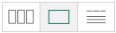
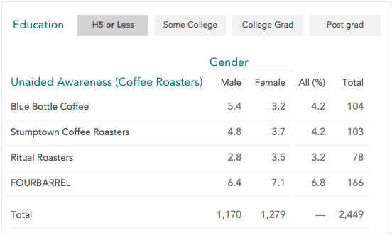
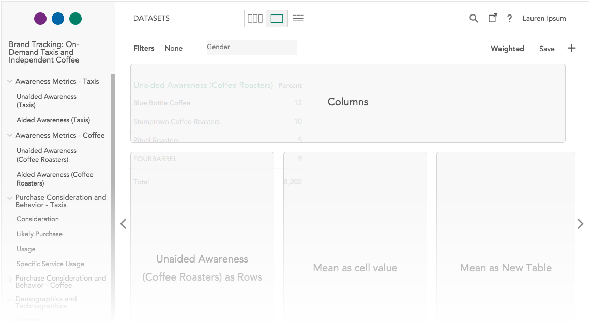
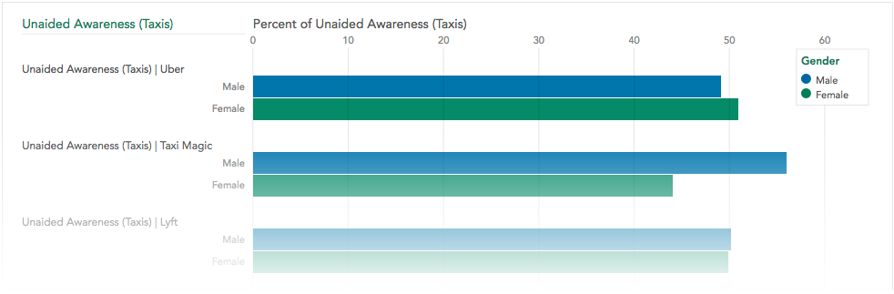
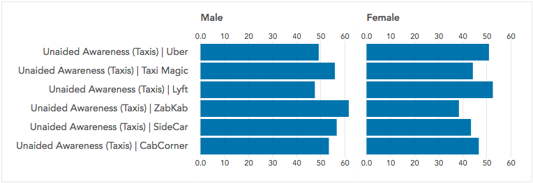
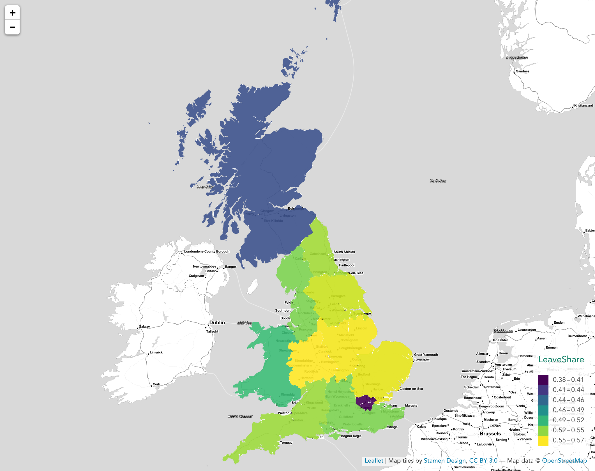
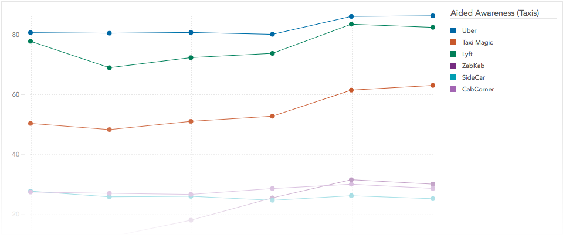
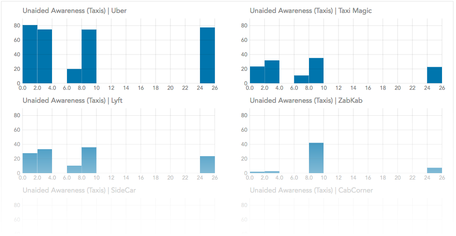

For a deeper look at data than what is available in [card view](./crunch_browsing.html), you can create, save, and export univariate and multivariate tables and graphs in **Expanded View**.

To enter this view:

* click the icon in the view toggle at the top of the interface to expand the variable card on the far left into a univariate table,

* double-click on a variable card in card view to expand the selected variable card as a univariate table,

* or drag a variable from the left sidebar list onto a card in card view to create a crosstab of the two selected variables.

When you enter this view, you will see a table of the selected analysis.

### Variables in an analysis

An analysis contains one or more variables. These variables have a role in the analysis; how the roles are named and viewed depends on how many variables there are and what analysis view you are looking at (see The Display Controller, below, for more information about changing the analysis view). Variables can be in the following roles:

- **Row Variable** – Defines the rows of a table or graph. In the case of a univariate analysis, the single variable is considered the row variable. In the example above, Unaided Awareness (Coffee Roasters) is the row variable.
- **Column/Group/Slice Variable** – In a table, the Column variable defines the table columns (Gender in the example above). When viewing the analysis as a graph, this variable can be used as the Group variable (when viewing the analysis as a single graph) or the Slice variable (when viewing the graph as a sliced graph of small multiples). See Grouped and Sliced Graphs, below, for an example of a sliced versus grouped graph.
- **Tab Variable** – Defines clickable tabs to show an analysis segmented across a third variable. In the example above Education is the tab variable, and we are currently looking at the HS or Less tab.  
- **Mean Variable** – You can use the mean of a variable as the values (rather than percentages or counts). For example, if we were to use Age as the mean in the table above, the upper-left cell would contain the mean age of Male, Blue Bottle Coffee Aware respondents.

### Adding and Replacing the Variables in the Analysis

Drag and drop a variable (from either the sidebar or the search panel) on to an analysis to show a collection of dropzones that allow you to add or replace variables used in the current analysis.

What dropzones are available varies depending on the type of variables, the number of variables, and the type of analysis.

In addition to dropzones for the analysis roles described above, there will always be a **Variable as New Table/Graph** dropzone. Dropping a variable here will remove all variables currently in the analysis and create a univariate analysis with the selected variable.

#### Categorical array variables

A categorical array – a variable made up of a group of items that share a common set of categories — defines two dimensions. When you make a new table or graph, the default view has the items as rows and the categories as a common set of columns, with percentages calculated by row. If you already have a column or group variable in an analysis, the categories of the array become the rows, with the same columns in place, and tabs appear to select an item of the array.

#### Components of array and multiple response variables

Categorical array and multiple response variables are made up of component that describe one column of an array or one category of a multiple response variable. If you want to use one of the component variables in an analysis click the + in the sidebar next to the variable name. This will display component variables that can be dragged to the analysis individually.

### Removing a variables from an analysis

Hover over a variable in an analysis to reveal an 'x' next to the variable name. Click the 'x' to remove the variable. (If the x doesn’t seem to show up — for instance some graphs may not provide the remove-variable button — simply change to table view to remove the variable.)

### Graph types

Tables have a consistent look regardless of variable types, but Crunch supports several different sorts of graphs depending on what sort of variables are being used.

#### Groups and Slices

When creating graphs you will see **Slice** and **Group** dropzones rather than just the **Column** option used for tables. What sort of graph you get will differ depending on where you drop the variable.

A grouped graph shows the analysis in a single graph — the analysis is broken down by the group variable within the categories of the row variable.

A sliced graph shows a series of small univariate graphs — one for each category in the second variable.

Graphs cannot contain both a group and slice variable at this time — if you add a group variable it will replace the slice variable and vice versa.

#### Choropleth maps

A choropleth shows data on a map by filling regions with colors along a scale. The simplest map will show the count or percentage of respondents in each region, just like a table, using a color scale designed for accurate identification of values, perceptual equivalence across its range, and usability for people with different color vision.

It is also possible to show either the mean of another variable (by dropping it on ‘use mean as cell value’), or percentages within each category of a crosstab. It is often helpful to switch between a table and graph for context, but regional differences often stand out dramatically when plotted on a map.

#### Time Plots

If a date/time variable is used as the column variable, the graph will be displayed as a time plot, showing the row variable over time.

#### Numeric Variables

When viewed as a graph, numeric variables will display a histogram. If sliced by a second variable, a histogram will be shown for each category in the second variable.

