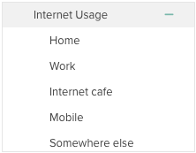

For a deeper look at a dataset than the top-level card view, you can create univariate and bivariate tables and graphs, save them, and export them to an Excel spreadsheet. To enter analyze mode, click "Analyze" at the top of the interface or double-click the header area of a variable card.

<h3 dir="ltr">Univariate Analyses</h3>

When analyze view opens, a univariate table is displayed using the variable that was on the far left of the workspace in browse mode. Numeric and date-time variables will be grouped into bins.

You can see a univariate analysis of another variable by clicking it in the sidebar.

<h3 dir="ltr">Drag and Drop to Slice by Columns and Pages</h3>
<figure><figcaption>A crosstab with rows, columns, and pages</figcaption></figure>

A second variable can be added to the analysis by dragging a variable from the sidebar on the left to the analysis. When a variable is dragged, dropzones will appear; dropping the variable onto ‘rows’, ‘columns’ or other areas will allow you to build more complex tables.

Depending on what sort of analysis is currently displayed and what type of variable is being dragged, the following dropzones may appear:

<ul>
<li dir="ltr">

Variable as New Table - Appears when dragging any variable to a table or graph. All current variables in the analysis will be removed and a new table or graph will be created using the new variable.

</li>
<li dir="ltr">

Variable as Columns - Appears when dragging any variable to a table. The dragged variable will be used as the column variable for the table, replacing the current column variable, if any.

</li>
<li dir="ltr">Variable as Tabs/Pages – Appears when you already have a table or a graph with two variables (a crosstab) to subset further by categories (or bins or units) of the dragged variable.</li>
<li dir="ltr">

Variable as Rows - Appears when dragging any variable to a table or graph. The dragged variable will be used as the row variable for the table or graph, replacing the current row variable.

</li>
<li dir="ltr">

Variable as Slice - Appears when dragging any variable to a graph. The dragged variable will be used to slice the graph (see Sliced Graphs, below), replacing the current slice or group variable, if any.

</li>
<li dir="ltr">

Variable as Group - Appears when dragging any variable to a graph. The dragged variable will be used to group the graph (see Grouped Graphs, below), replacing the current slice or group variable, if any.

</li>
<li dir="ltr">

Mean of Variable As (Cell) Value - Appears when dragging a numeric variable to a graph or table). The mean of the dragged variable will be used as the cell values (for tables) or values (for graphs) rather than counts or percentages.

</li>
<li dir="ltr">

Variable over Time - Appears when dragging a date/time variable to a graph. The dragged variable will be used to create a time plot for the row variable. This will replace the current group or slice variable.

</li>
</ul>
<h4 dir="ltr">Analyzing categorical array variables</h4>

Unlike other variable types, a categorical array — a variable made up of a group of items that share a common set of categories — defines two dimensions. When you make a new table or graph, the default view has the items as rows and the categories as a common set of columns, with percentages calculated by row. If you already have a column or group variable in an analysis, the categories of the array become the rows, with the same columns in place, and tabs appear to select an item of the array.

If you want to use one of the component variables that make up the array click the + in the sidebar next to the variable name. This will display the component variables that can be dragged to the analysis individually.

 

<h3 dir="ltr">Using the Display Controller</h3>

The Display Controller at the bottom of the analyze interface is used to change some settings.

Which controls are displayed depends on the analysis being viewed. The following controls are available:

<table><colgroup><col width="135" /><col width="601" /></colgroup>
<tbody>
<tr>
<td>

</td>
<td>

Table/Graph - Use this control to toggle between showing a table and a graph. The graph type will vary by the types of the variables in the analysis.

</td>
</tr>
<tr>
<td>

</td>
<td>

Count/Percentage, Percent Direction, and Significance testing - Use this control to toggle between counts and percentages. If viewing percentages in a bivariate table or graph, click the arrow control to toggle between percentages summing by column (down), by row (right), or across the whole table. When viewing a table, click the * to enable significance testing - this will add shading to the graph indicating if a value is significantly above or below the mean value for that row or column (depending on how the percentages are being summed).

</td>
</tr>
<tr>
<td>

</td>
<td>

Decimal Places - If viewing an analysis that uses decimal points either for percentages or for numeric means, use this control to determine how many digits are shown after the decimal point.

</td>
</tr>
<tr>
<td>

</td>
<td>

Show Empty - If unselected any rows or columns in a table or graph that are entirely empty will be hidden. If selected empty rows and columns will be displayed. Note that adding filters may cause a row or column to become empty.

</td>
</tr>
<tr>
<td>

</td>
<td>

Pivot - Click this control to swap the row variable and the column/group/slice variable.

</td>
</tr>
</tbody>
</table>

<h3 dir="ltr">Saving Analyses</h3>

Once you have created an analysis that you want to keep you can save it by clicking <strong>Save</strong> in the upper right. This will slide out the save tray and add the current analysis to it.

Saved analyses will show the row and column variable used to create the analysis with an icon that indicates a graph or a table. 

The information saved in an analysis includes:

<ul>
<li dir="ltr">

The variables used to create the analysis.

</li>
<li dir="ltr">

Any settings in the play controller.

</li>
<li dir="ltr">

Any filters that are currently applied.

</li>
<li dir="ltr">

Whether the data is weighted.

</li>
</ul>

Clicking an analysis in the save tray will cause it to be loaded into the analysis workspace.

An analysis can be deleted by hovering over it in the save tray and clicking the x button.

Close the save tray by clicking the X above it. When the save tray is closed, you can open it by clicking the plus symbol.

<h3 dir="ltr">Exporting Analyses</h3>

Click <strong>Export to Excel</strong> to export all saved analyses to an Excel document. Each analysis will be put into a separate sheet in the Excel file, and the valid/missing counts, as well as any active filters, will be included alongside the table.

