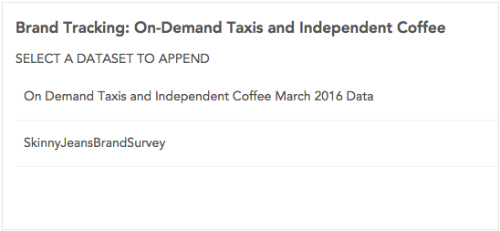

You can append a dataset to the current dataset to add more rows of data. Currently Crunch does limited validation of appended data, so it is recommended you verify that the dataset you are appending contains appropriate data. You may also wish to save a version of your dataset before appending as described in [Dataset History](crunch_dataset-history.html).

To append data, click the dataset name in the upper-left and then select the **Manage Data** tab. You will see a list of datasets to which you have access.

Select a dataset and click **Next** to append it. Appending may take a few minutes depending on the size of your datasets. Once you are finished, you will either see a success message or you will be informed that the append failed. If you are having trouble appending data, please contact us at [support@crunch.io](mailto:support@crunch.io).