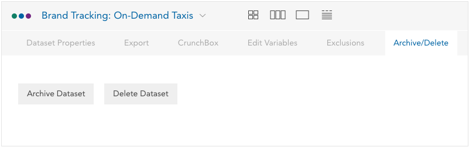

Datasets can be archived or deleted. Select **Archive/Delete** from the
dataset properties menu. When a dataset is archived it can be accessed and
restored by the owner from the Archive label in the dataset list. If a dataset
is deleted, it is removed permanently and cannot be recovered.
