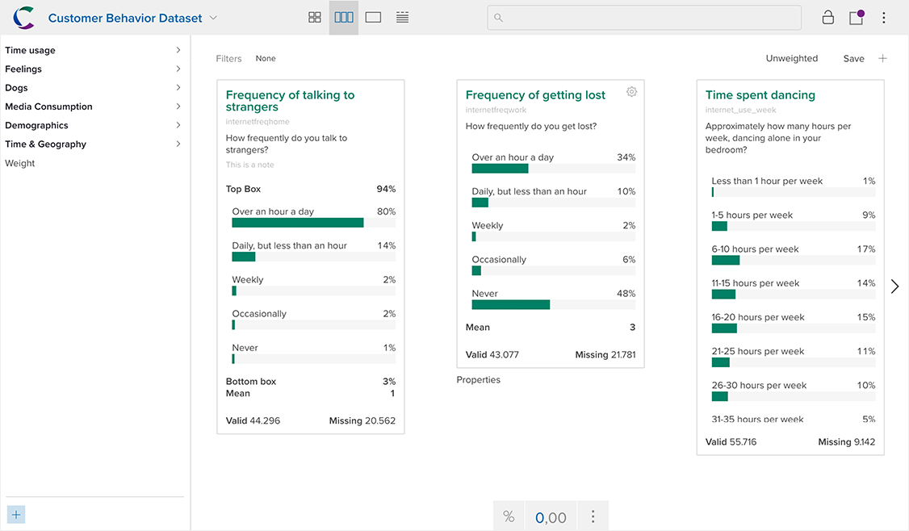

When you open a dataset it will be in browse mode.

Browse mode displays top-line views of each variable in a series of cards. Each card represents a single variable - the number of cards you can see at a time will vary based on the card width and the width of your display.

You can browse through variables using the arrows on the left and right.

The sidebar on the left displays all the variables in the dataset organized into a series of tags by the dataset owner. Click a tag open it. Click a variable to navigate directly to it.

