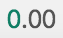
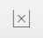

When you open a dataset, the card view of the dataset will load.

Card view displays top-line summaries of each variable in a series of cards.
Each card represents a single variable - the number of cards you can see at a
time will vary based on the card width and the width of your display.

You can browse through variables by clicking the arrows on the left and right or by using your left/right arrow keys.

The sidebar on the left displays all the variables in the dataset, typically organized
into a series of groups by the dataset owner. Click a group name open it. Click a
variable to navigate directly to it.

### Using the Display Controller

The Display Controller at the bottom of the screen is used to
change some settings:

---|---  

|

Decimal Places - If viewing an analysis that uses decimal points either for
percentages or for numeric means, use this control to determine how many
digits are shown after the decimal point.  

|

Show Empty - If unselected any rows or columns in a table or graph that are
entirely empty will be hidden. If selected empty rows and columns will be
displayed. Note that adding filters may cause a row or column to become empty.  

 
