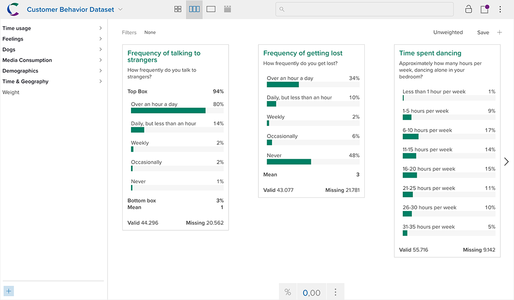
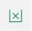

When you open a dataset, the card view of the dataset will load. If you are in another view, you can return to card view by clicking the far left icon in the view control at the top of the page:

Card view displays top-line summaries of each variable in a series of cards. Each card represents a single variable — the number of cards you can see at a time will vary based on the card widths and the width of your display.

Browse through variables by clicking the arrows on the left and right or by using your left/right arrow keys.

The sidebar on the left displays all the variables in the dataset, typically organized into a series of groups by the dataset owner. Click a group name open it. Click a variable to navigate directly to it.

### Searching for a variable

In larger datasets, it may be helpful to search for a variable. Click the search icon in the upper right corner to open the search tray. From here you can search for a variable by name, description, alias, or category name (e.g. searching for "Male" would find the variable "Gender").

### Using the Display Controller

Use the Display Controller at the bottom of the screen to change display settings. 

If you don't see the display controller, move the pointer towards the bottom of the screen to reveal it.

In card view, the play controller contains the following controls:

<table>
    <tr>
        <td></td>
        <td>
<strong>Decimal Places</strong> – Sets the number of digits shown after the decimal point for percentages or numeric means.
</td>
    </tr>
    <tr>
        <td></td>
        <td>
<strong>Counts/Percents</strong> – Toggles between showing counts and percentages for categorical, array, and multiple-response variables.
</td>
    </tr>
    <tr>
        <td></td>
        <td>
<strong>Show/Hide Empty</strong> – Toggles between showing and hiding categories with no valid values (e.g. if an applied filter has resulted in some categories being empty).
</td>
    </tr>
</table>
 
