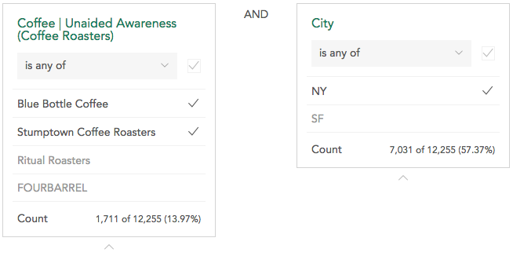

This topic covers using the filter builder to create and edit filters and using the filter organizer to change the order of shared filters. See [Filtering Data](crunch_filtering-data.html) for information about using filters with your data.

### Building a Filter

<a class="video" onclick="window.open('https://www.youtube.com/embed/2dJ1eQB-ugk?rel=0&amp;controls=0&amp;autoplay=1', '_blank', 'location=yes,height=650,width=1120,scrollbars=no,status=yes');">See video</a>

Use the filter builder if:

* You want to create a more complex filter that includes multiple categories or multiple variables.

* You want to save the filter to use later.

* You are a dataset editor and you want to create a filter that anyone who has access to the dataset can use.

To open the filter builder, select **New filter…** from the drop-down menu.

A filter can contain one or more conditions. To add a condition choose a variable in the sidebar and click it or drag it to the target to see the categories for that variable.

Click the categories in the variable to toggle them off and on for the filter you are building. The filtered count for the condition is displayed at the bottom of the condition.

You can select or deselect all categories at once using the checkbox in the header.

By default, all selected categories will be filtered, but you can use the dropdown at the top to filter on categories not selected (e.g. "Not California"). If a condition is created from a multiple response variable, this dropdown also allows you to filter based on either *all* of the categories being selected or *any* of the categories being selected.

When you add multiple conditions you can choose whether all conditions have to be true (AND) or whether any condition has to be true (OR).

To delete a condition from a filter, click the X that appears in the upper right corner when you hover.

Once a filter has one or more conditions and a name it can be saved.

If you are a dataset editor, you will see a personal/shared toggle in the upper right.

Personal filters can only be seen and used by you; shared filters are available to all users on the dataset. If you are not an editor, you can only make personal filters.

After saving a filter it will be automatically applied.

### Editing or deleting a filter

You can only edit or delete filters you have created unless you are a dataset editor.

To edit a filter you can either:

  * Click edit next to a filter name in the drop down list or

  * Select “Edit filter…” after clicking an already selected filter in the filter bar.

This opens the filter builder with the selected filter. When editing a filter click Delete in the lower right to delete it.

You can view, but not edit, filters that are available to all users on the dataset.

### Organizing Filters

Filters that area available to all users on the dataset can be organized by a dataset editor (by default they are listed alphabetically)

If you are the current editor of the dataset (e.g. you have edit permissions and the dataset is unlocked as described in [Datasets with Multiple Editors](crunch_multiple-editors.html)), the **Organize...** option will appear in the filter dropdown.

Click **Organize** to slide out the **Organize Filters** panel.

Drag the filters into an order of your choosing and click **Save**.

At this time personal filters cannot be ordered.
