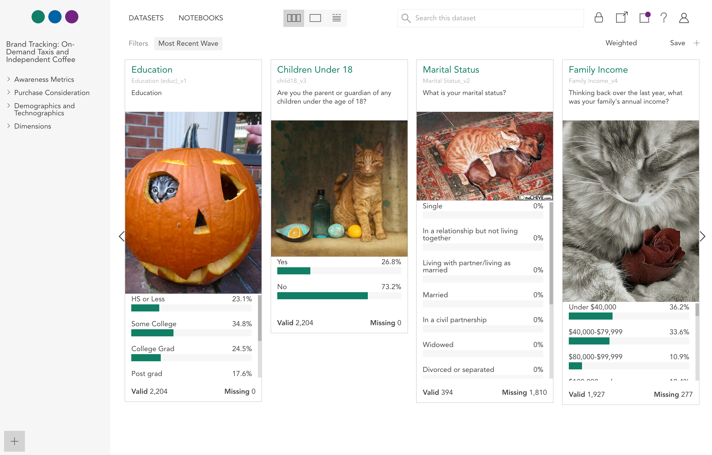
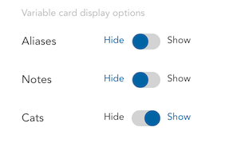

All variables, **cat**egorical and otherwise, can also display a random picture of a cat. Images are retrieved using a new integration with [The Cat API](http://thecatapi.com/). This option can be enabled in User Settings.

To open User Settings, click the person icon in the upper right corner of the application and select **Settings**.

This opens the **User Settings** panel.

Set the **Cats** slider to **show**, click **Save**, and see your data like never before.
