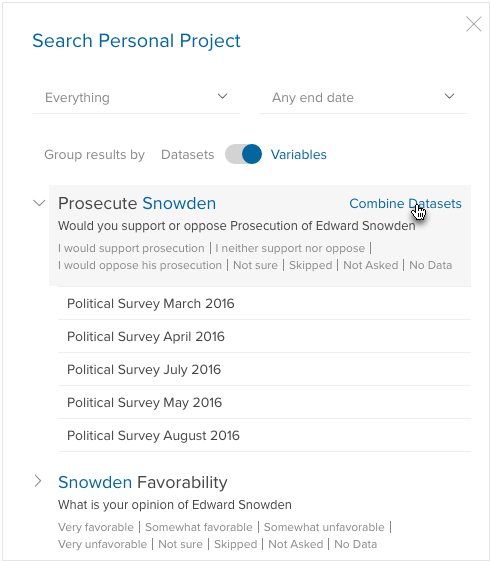
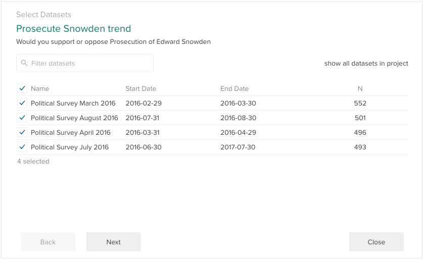
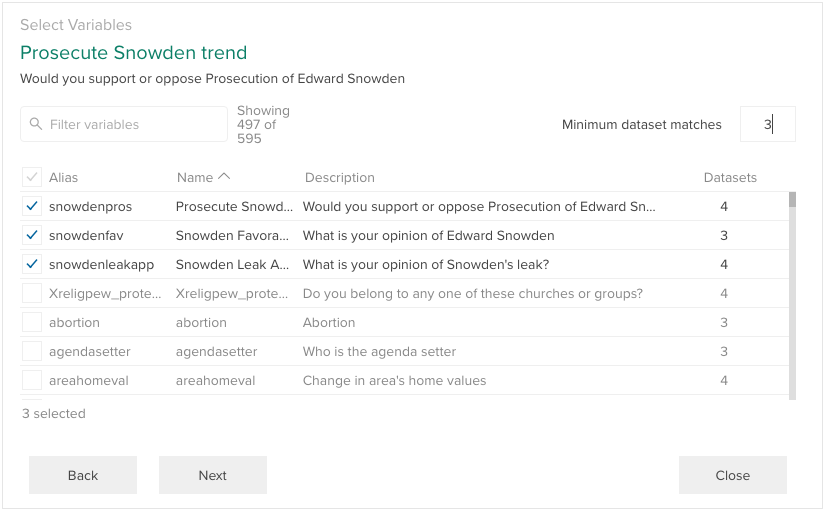
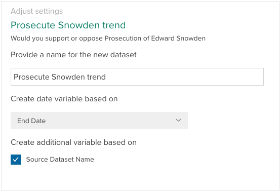
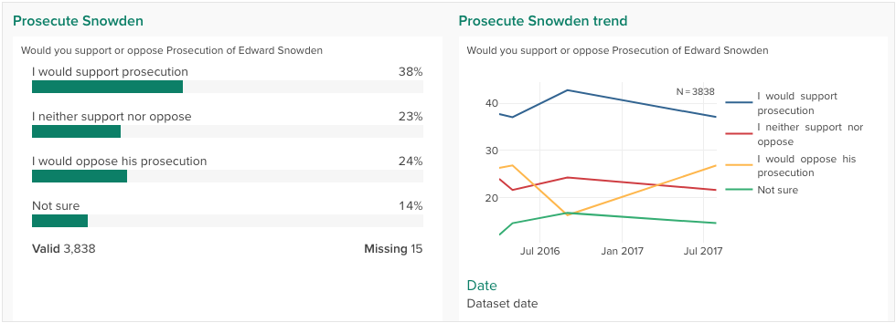

This feature lets you create a new dataset using a selection of variables from multiple datasets, allowing you to track these variables over time and across geographies. For example, imagine a monthly political survey: every month may have some new questions, but some of the same questions will be asked repeatedly. This feature allows you to track the responses to those common questions over all the surveys.

To combine datasets, follow these steps:

### 1. Search for a variable you'd like to track over multiple datasets
While viewing a project (or your personal project), click the + in the lower-left corner and select **Combine Datasets** from the menu. This will open the search panel with the **Datasets/Variables** slider set to **Variables** (which groups the search results by variable). Enter a search term, and in the results, hover on the variable you want to track and select **Combine Datasets**. This will start the process using the datasets that contain that variable. You'll be able to select other variables to keep as well.

Note that variables are matched using their aliases, so you'll want to assure that all of the datasets use consistent aliases for the variable(s) you want to use in the combined dataset.

### 2. Select datasets to combine

The combine datasets panel opens and displays all the datasets in which the selected variable appears:

By default all displayed datasets will be selected. You can deselect any datasets you don't want to be included in your combined dataset. If you want to see and select from all datasets in the project (e.g. including the ones that did not include the variable selected in step 1), click **show all datasets in project**. You can look for a specific dataset using the **Filter dataset** input.

Once you have selected the datasets you want to combine, click **Next** to continue.

### 3. Select variables to include in combined dataset

The variable selector opens:

By default, only the variable selected in step 1 will be selected, but you can select any number of variables that appear in at least one of the selected datasets. Since the set of all variables across many datasets can be quite long, this list can be filtered in a couple of ways:

* Use the **Filter variables** input to search for specific variables that you want to include.

* Set **Minimum dataset matches** to set a minimum number of datasets that a variable must appear in to be displayed in the list. The list can also be sorted by this attribute by clicking the **Datasets** column header.

Once you have selected the variables you want to keep, click **Next**.

### 4. Set the dataset name and optionally create new variables

The combine datasets options panel opens:

In this panel you can set the following options:

* **Dataset name** – The name of the new combined dataset.
* **Create date variable** – If the datasets being combined include start dates and/or end dates as part of their metadata, you can create a new date variable in the resulting dataset based on either using the dropdown.
* **Create dataset variable** – You can optionally create a variable that contains the source dataset name for each row of data in the combined dataset. This can be used as an alternate way to analyze variables by wave, period, region, or whatever unit the separate datasets entail (for example, if the combined datasets were collected in different regions).

Once you have selected options, click **Finish** to create the new dataset.

The new dataset will automatically have a [Dashboard](./crunch_dashboards.html) created. It will contain the combined variable initially selected in step 1 and, if a date variable was created in step 4, a time series tracking that variable over time.

## Tips for getting the most out of the feature

Currently, the system makes a number of assumptions about the input data being “clean” in a few ways. To the extent these assumptions limit how useful combine is for your particular data, we view each as an opportunity.

1. Variables are matched by their “alias” across datasets. It may be necessary to use a script to re-alias in the datasets you’re trying to combine. As a best practice, we advise aliases with semantic meaning: “unaided_awareness” is a better alias than “Q1”. We are working on more flexible (some might say magic) matching, though, so the system will be able to line up Q1 and Q21 if we detect that they are actually “the same question”.
2. Variable names and descriptions in the result are taken from the first dataset in the series.
3. The result always has the union of categories, matched exactly by name. Because it’s common to change order  or randomize response categories in different cross-sections, category names are matched and given the ids found in the first dataset of the series. For the moment, spelling, language, and capitalization differences between datasets will result in new categories in the result. Next we plan to let you combine categories by id or code, if you trust that multilingual datasets share consistent ids. Eventually, you’ll be able to edit the detailed category mapping for each constituent dataset.
4. In order to build a useful time or ‘wave’ variable, datasets need to have `start_date`, `end_date`, or both set in their metadata. We know that some datasets have row-level date/time variable, possibly a scalar date, but maybe even a precise collection time. The system will eventually be able to inspect those or use one as the Wave variable. Almost as often datasets encode wave information in their names, notes, or description strings — all of them reasonable approaches.
5. *What if you could go back and edit* any of these parts of the combination “recipe”? That’s where we’re headed.
6. *What if you pointed to a folder* of datasets and said to the system: “figure it out”? One day it will.
