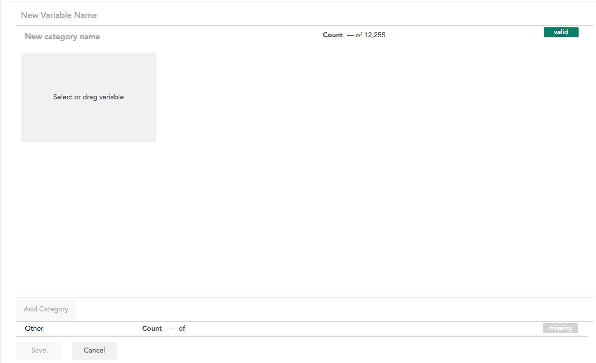
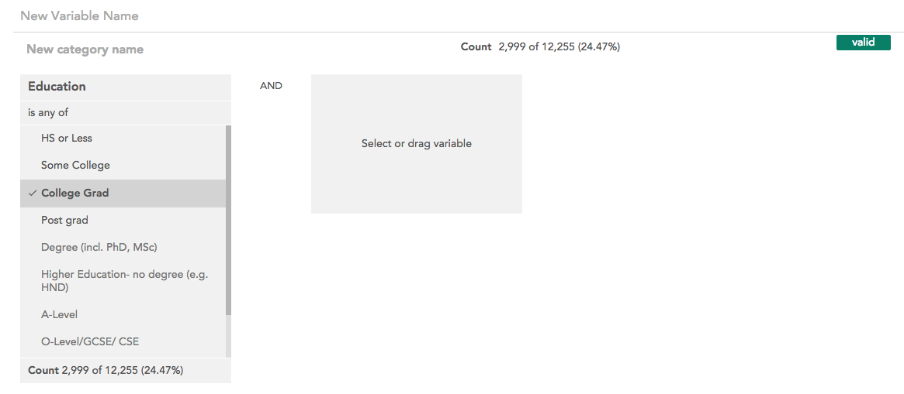
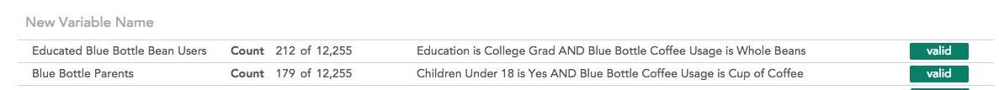
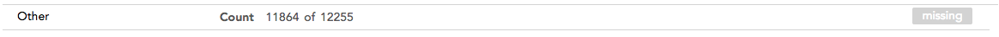

When you open the categorical variable builder from the [New variables](crunch_creating-variables-2.html) page the following interface opens:

This interface allows you to define categories for the new categorical variable one at a time. Select a variable from the sidebar by clicking or dragging it to get started. The selected variable will be added to the open category.

Defining a category works just like the [Filter Builder](crunch_filtering-data.html) — you can define what rows of the data will be included in the category based on other variables in the dataset.

Once you have finished defining a category, click **Add Category** to close that category and start a new one. You must name a category before starting a new one. As you add categories, they will be shown at the top of the interface.

Click on a category to expand it and edit it.

You can change the order of categories by clicking and dragging them to a new spot in the list. The categories will be evaluated in order, so if a row evaluates as true for more than one category, it will be included in the top-most one.

The valid/missing toggle on the right side of each category determines whether the category will be counted as valid or missing in the new variable.

At the bottom of the interface is the Other category:

This category contains all rows that meet none of the defined conditions. By default it is named Other and marked missing, but you can edit the name and toggle whether it is valid or missing. It cannot be moved from the bottom position in the variable.

Once you have finished defining categories, click Save to create the variable. The variable must have a name in order to be saved.
