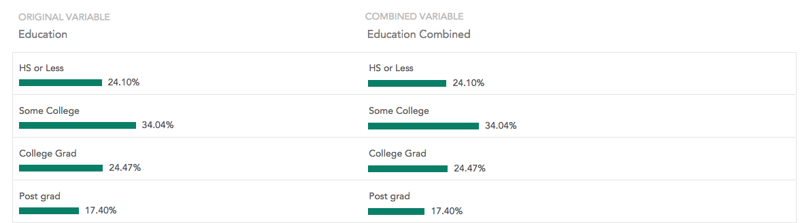
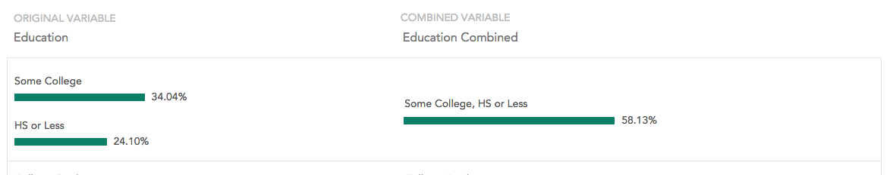

When you create a combined variable, you first will need to select the variable it will be based on. Click or drag a variable from the sidebar. The Combine Variable interface opens:

Note that the screenshot above shows the interface for combining a categorical variable. The interfaces for combining multiple response and array variables don't show the values but otherwise function identically.

The left side of the interface shows the source variable and the right side shows the variable that will be created. Click the variable name or category names on the right side of the interface to rename them. To combine categories drag them together. Combined categories will show the categories that were used to create them on the left and the new category on the right:

Right-click a combined category and select <strong>Split Category</strong> to split it back into its component categories.

Hover over a category to show the valid/missing toggle on the right side. Use this to determine whether the category will be valid or missing in the new variable.

Once you have finished combining categories, click <b>Save </b>to create the new variable.

 

 

