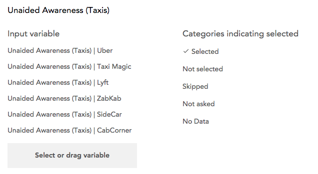

Only a dataset editor can create a multiple response variable.

To create a multiple response variable, click **+New Variable** at the bottom of the sidebar and select **Build Multiple Response Variable** from the Create Variable page. This opens the Multiple Response Variable Builder.

 
 
Select or drag the variables that will be used to create the new variable. Each of these variables will be one category in the new multiple response variable.

As variables are added to the multiple response variable interface, the categories of these variables will appear in a list. Select all categories that indicate a positive or "selected" response. 

When you bind categorical variables into a multiple response variable, the original variables are no longer available separately, though each is available from the sidebar as a subvariable that can be dragged into an analysis.
