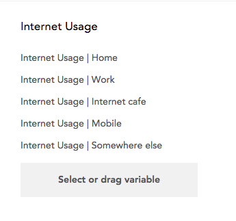

Only a dataset editor can create an array variable.

To create an array variable, click **+New Variable** at the bottom of the sidebar and select **Build Array Variable** from the Create Variable page. This opens the Array Variable Builder.

Select or drag the variables that will form the "subvariables", or rows of the array. The columns of the array will be formed by the union of the categories of all selected variables. Typically, an array will be comprised of variables that share a set of categories.

When you bind categorical variables into an array variable, the original variables are no longer available separately, though each is available from the sidebar as a subvariable that can be dragged into an analysis.
