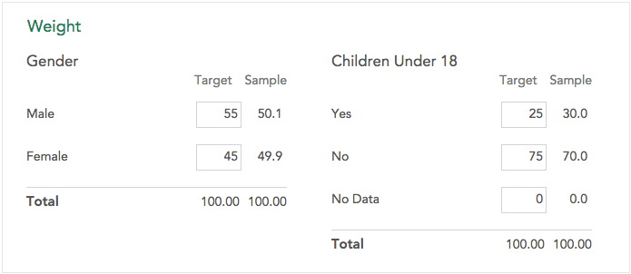

New variables can be derived from existing variables. Create a new variable by hovering over the '+' at the bottom of the sidebar and clicking **+ New Variable** when it expands.

#### Public and Private Variables

Array, Multiple Response, and Weight variables are always created as public to all viewers of the dataset. Other new variables can be public to all users or private to the user who created them. See [Variable Properties](crunch_variable-properties.html) for more information.

### Combining Categories

See [Combining Categories](crunch_creating-a-combined-variable.html).

### Build a Categorical Variable

See [Build Categorical Variable](crunch_creating-a-categorical-variable.html).

### Build a Categorical Array Variable

To create an array variable, select or drag the variables that will form the "subvariables", or rows of the array. The columns of the array will be formed by the union of the categories of all selected variables. Typically, an array will be comprised of variables that share a set of categories.

Note that when creating a categorical array variable, the variables you group to form the array will no longer appear separately in the web application. This is in contrast to combining categories, which does not overwrite the uncombined source variable, but rather creates a new variable with the smaller set of categories. 

### Build a Multiple Response Variable

 

To create a multiple response variable:

  1. Select or drag the variables that will be used to create the new variable. Each of these variables will be one category in the new multiple response variable.
  2. As variables are added to the multiple response variable interface, the categories of these variables will appear in a list. Select all categories that indicate a positive or "selected" response. 

When you bind categorical variables into a multiple response variable, the original variables are no longer available separately, though each is available from the sidebar as a subvariable that can be dragged into an analysis.

### Creating a Weight

Weighting a dataset allows you to adjust the data to a specific required ratio of one or more variables - usually demographic variables. For example, if 1000 people were surveyed - 600 men and 400 women, but the study in question was for an area that had a 50/50 split of men and women, you could weight the responses of the women a little more heavily to adjust for the uneven split in your sample size.

A weight variable is a numeric variable where each row contains a multiplier that indicates how that row should be given more or less importance. When a weight is created in Crunch.io, this numeric weight variable is created by specifying the target values for one or more categorical values (in the example above, 55% Male and 45% Female). A weight variable can be constructed from multiple categorical variables (for example to adjust the data for target gender, age, and income distributions).

To create a weight:

  1. Select one or more existing categorical variables that will be used to create the weight.
  2. For each selected variable, their categories and the distribution of responses in those categories will be shown in the **Sample** column. Enter the normalized values you would like to use in the **Target** column. These values must sum to 100.
  3. Name the weight by clicking on the name. The default name is **Weight**, since it is common for a dataset to contain only a single weight.

Once a weight is created it will be applied to the dataset. Multiple weights can be created - which one is applied can be changed using the weight menu in the upper right.