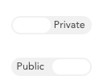

New variables can be derived from existing variables. To start creating a new variable, click **+New Variable** at the bottom of the sidebar.

#### Public and Private Variables

Categorical variables and Combined variables can be created on a dataset by any user. When a dataset viewer creates one of these variables, they are always private - only the use who created it can see and use the variable. When a dataset editor creates a combined variable or a categorical variable, the Public/Private toggle appears in the upper-right corner. This slider determines if the new variable is private (available only to the user that created it) or public (available to everyone who can access the dataset). Array, Multiple Response, and Weight variables are always created as public to all viewers of the dataset.

### Creating a Combined variable

See [Creating a Combined Variable](crunch_creating-a-combined-variable.html).

### Creating a Categorical Variable

See [Creating a Categorical Variable](crunch_creating-a-categorical-variable.html).

### Creating a Categorical Array Variable

To create an array variable, select or drag the variables that represent the items that share common categories. The columns of the array will be formed by the union of the categories of all selected variables. Typically, an array will be comprised of variables that share a set of categories.

Note that when creating a categorical array variable, the variables you group to form the array will no longer appear separately in the web application. This is in contrast with the combined-categories variable, which does not overwrite the uncombined source variable. You will, however, be able to access the subvariables within a categorical array separately for analysis.

### Creating a Multiple Response Variable

 

To create a multiple response variable:

  1. Select or drag the variables that will be used to create the new variable. Each of these variables will be one category in the new multiple response variable.
  2. As variables are added to the multiple response variable interface, the categories of these variables will appear in a list. Select all categories that indicate a positive or "selected" response. 

As with creating a categorical array, when you bind categorical variables into a multiple response variable, they are no longer available separately in the web application.

### Creating a Weight

Weighting a dataset allows you to adjust the data to a specific required ratio of one or more variables - usually demographic variables. For example, if 1000 people were surveyed and the sample had 600 men and 400 women, a weight can adjust values to reflect the population proportions.

A weight variable is a numeric variable where each row contains a multiplier that indicates how that row should be given more or less importance. When a weight is created in Crunch.io, this numeric weight variable is created by specifying the target values for one or more categorical values (in the example above, 50% Male and 50% Female). A weight variable can be constructed from multiple categorical variables (for example to adjust the data for target genders, ages, and incomes).

To create a weight:

  1. Select one or more existing categorical variables that will be used to create the weight.
  2. For each selected variable, their categories and the distribution of responses in those categories will be shown in the **SAMPLE** row. Enter the normalized values you would like to use in the **TOTAL** row. These values must sum to 100.

Once a weight is created it will be applied to the dataset. Multiple weights can be created — which one is applied can be changed using the weight menu in the upper right.

 