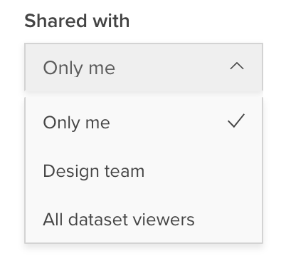

You can derive new variables based on existing variables in a dataset.

To create a derived variable click **+New Variable** at the bottom of the variable list in the left sidebar. This opens the New Variable page where you can select what type of variable you want to create:

  * **Combine categories** – Derive a variable by combining categories from an existing categorical, multiple response, or array variable. For example, starting with a variable that recorded people's opinions on issues on a scale from 1-10, you could derive a variable that combines the "1-3" responses into "Disagree", "4-7" into "Unsure", and "8-10" into "Agree". The type of variable created will be the same as the type of the variable it is based on. See [Combining Categories](crunch_creating-a-combined-variable.html)

  * **Categorical variable** – To derive a categorical variable, define each category with a logical expression based on one or more existing variables. For example, you could derive a variable that defined "Soccer Moms" as "Gender = Female" and "Children Under 18 = Yes" and "Single Dads" as "Gender = Male", "Children Under 18 = Yes", and "Marital Status = Single, Divorced, or Widowed". See [Building Categorical Variables](crunch_creating-a-categorical-variable.html).

###Personal and Shared Variables
If you are a viewer on the dataset, derived variables will be personal – available only to you. They will appear in the **My Variables** folder at the top of the variable accordion.

Dataset editors can choose to make a derived variable available to all users on the dataset. When creating a derived variable, an editor will see the Personal/Shared toggle in the upper right.

Set the toggle to **Shared** make it available to all users. Set it to **Personal** to make it available only to you.

You can change whether a variable is personal or shared in [Variable Properties](crunch_variable-properties).
