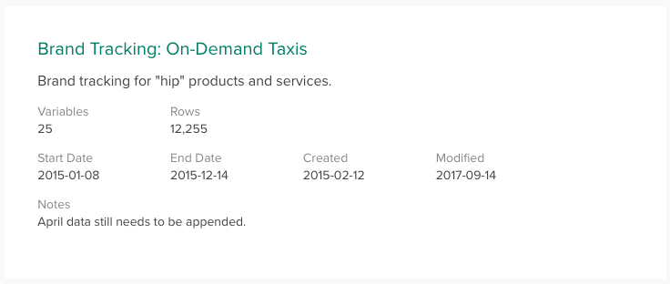
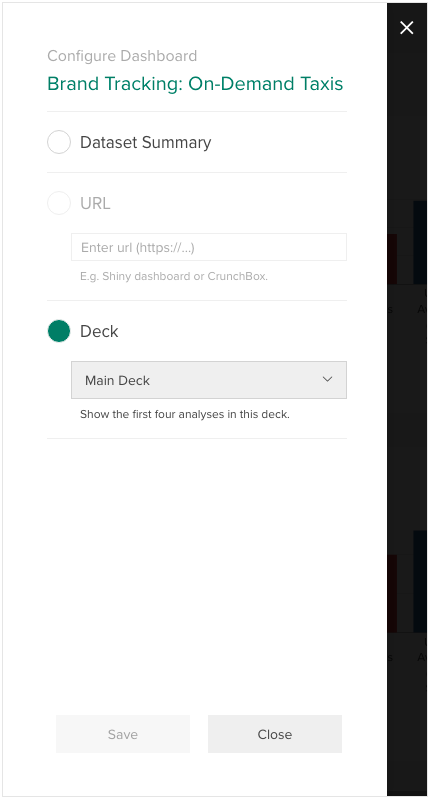
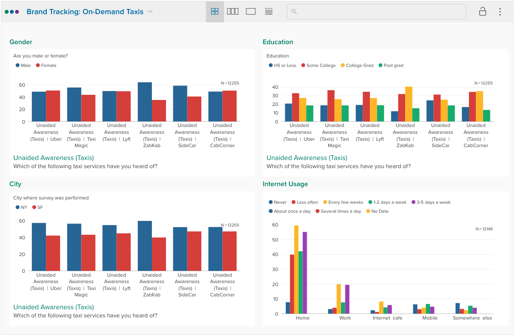
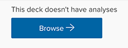

The first thing a user sees when they open a dataset is its **Dashboard**. By default, the dashboard is a summary of the dataset based on its [Dataset Properties](crunch_dataset-properties.html).

To customize this dashboard page, click the dataset name and select **Configure Dashboard** from the dropdown to open the dashboard configuration panel.

In this panel you can select one of the following options:

### Dataset Summary
This is the default view – a summary of the dataset metadata configured in [dataset properties](crunch_dataset-properties.html), as seen above.

### URL
Select **URL** to specify a custom URL that will be loaded as the dataset dashboard. This can be used to show any web-based content you host in another location, such as a Shiny dashboard built in R and hosted by Crunch. For more information about using on using Shiny with Crunch, see the [“Crunchy” GitHub project](https://github.com/Crunch-io/crunchy) and its [instructions](https://github.com/Crunch-io/crunchy/wiki/Deploying-your-Crunchy-app).

### Deck
Select **Deck** to choose a deck to use as a dashboard. The first four analyses saved to that deck will be displayed in a two-by-two grid.

The selected deck will become shared (available to all users on the dataset) when it is used as a dashboard. See [Saving, Exporting, and Sharing Analyses](crunch_saving-analyses.html) for more information about creating decks.

If a deck contains no analyses and **Deck** is selected the dashboard will display the dataset summary.

