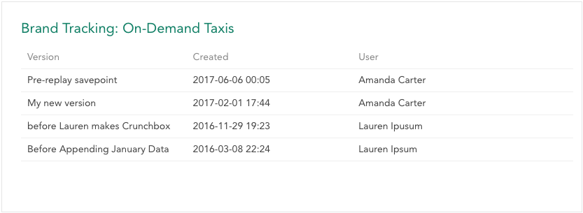

Dataset history allows you to create a saved version of the dataset and restore the dataset to previously created save points. 

To open dataset history, click the dataset name in the upper-left and select the **History** tab. By default, the history will show a single version of the dataset which is created immediately after the dataset is created. Versions are listed from most recent to oldest.

### Saving a Dataset Version

To Save the current version of the dataset (allowing you to easily restore to this point in the future), click **Save a Version**.

Enter a name for the version and click **Save** to create a new saved version.

### Editing and Restoring a Version

To edit or restore a saved version, click the version in the list.

In this dialog you can edit the name of the version and save or you can click **Restore** to restore the dataset to that version. Note that this cannot be undone and you will lose any changes that you made to the dataset after creating that version.