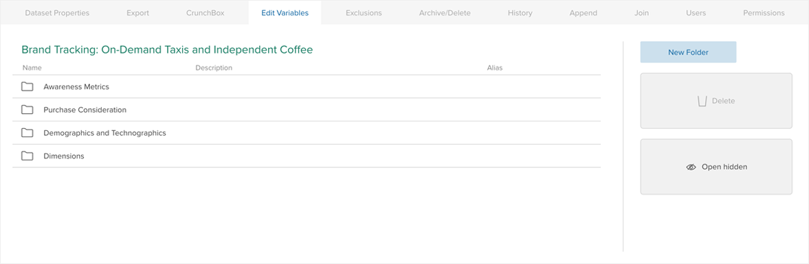
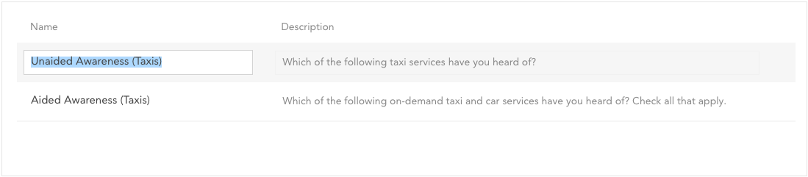
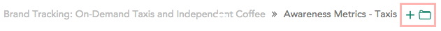
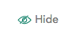

### Organizing Variables

The variable organizer allows a dataset editor to quickly edit variable names
and descriptions and manage how they will appear in the sidebar by sorting
them and arranging them into groups.

#### Editing variable names and descriptions

Click on a variable name or description to edit it. Use the tab key to cycle
through the name and description fields.

#### Changing variable order

The order of variables in the list can be changed by dragging and dropping
them. Select multiple variables at once using shift-click and command-click
(Mac)/control-click (PC). Once a group of variables has been selected they can
be dragged as a group.

#### Creating and using folders

Create a folder by clicking the add folder icon. You can drag and drop
variables into the folder to move them. Click the folder name to rename it.
Click the folder icon to open the folder and view and organize its contents.

When a folder is open, the path to that folder is shown at the top of the
interface. Drag variables from the list to a location on the path to move them
up in the hierarchy. Click on a location on the path to navigate to it
directly.

#### Hiding and unhiding variables

When a variable is selected, commands that can be applied to that variable
will appear above the list. Click **Hide** to hide a variable and **Unhide**
to show it again. Hidden variables cannot be seen in Browse or Analyze mode,
but any variables derived from it will be unaffected.

### Creating an Exclusion

An exclusion is essentially a permanent filter. Select **Exclusions** from the
dataset properties menu to open an interface identical to the [Filter
Builder](2-help/5-filtering-data.html) in which to create an exclusion. When
analyzing the dataset, it will behave as if the excluded rows do not exist.

### Archiving and Deleting Data

Datasets can be archived or deleted. Select **Archive/Delete** from the
dataset properties menu. When a dataset is archived it can be accessed and
restored by the owner from the Archive label in the dataset list. If a dataset
is deleted, it is removed permanently and cannot be recovered.

