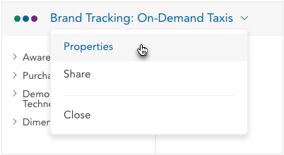
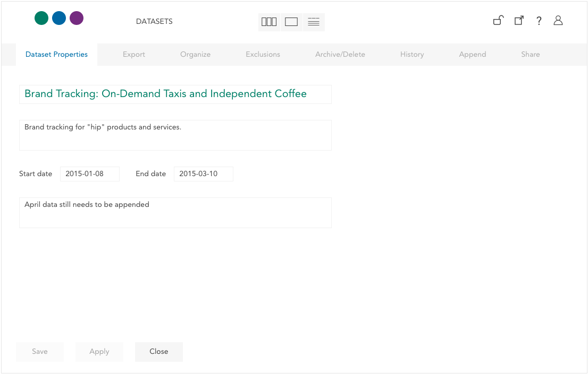

Open dataset properties by clicking on the dataset name and selecting Properties from the dropdown.

Dataset properties can be edited by the active editor (see [Datasets with Multiple Editors](crunch_multiple-editors.html)).

The primary dataset properties page allows you to edit the following:

**Name** – Click the dataset name to edit it.

**Description** - Click the dataset description to edit it.

**Start Date/End Date** - When was the data collected? These properties are included to allow start and end dates (distinct, obviously, from dataset creation or modification times) to be included as dataset attributes.

**Notes** - If you have more detailed notes about the dataset beyond its description, you can include them here.
