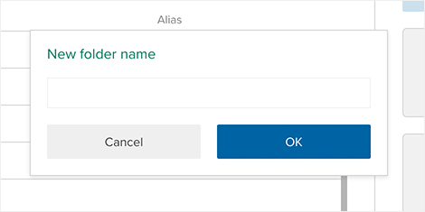

<h3>Organizing Variables</h3>

The variable organizer allows a dataset editor to quickly edit variable names and descriptions and manage how they will appear in the sidebar by sorting them and arranging them into groups. 

<h4>Editing variable names and descriptions</h4>

Click on a variable name or description to edit it. Use the tab key to cycle through the name and description fields.

<h4>Changing variable order</h4>

The order of variables in the list can be changed by dragging and dropping them. Select multiple variables at once using shift-click and command-click (Mac)/control-click (PC). Once a group of variables has been selected they can be dragged as a group.

<h4>Creating and using folders</h4>

Create a folder by clicking the add folder icon. You can drag and drop variables into the folder to move them. Click the folder name to rename it. Click the folder icon to open the folder and view and organize its contents.

When a folder is open, the path to that folder is shown at the top of the interface. Drag variables from the list to a location on the path to move them up in the hierarchy. Click on a location on the path to navigate to it directly.

<h4>Hiding and unhiding variables</h4>

When a variable is selected, commands that can be applied to that variable will appear above the list. Click <strong>Hide</strong> to hide a variable and <strong>Unhide</strong> to show it again. Hidden variables cannot be seen in Browse or Analyze mode, but any variables derived from it will be unaffected.

<h3>Creating an Exclusion</h3>

An exclusion is essentially a permanent filter. Select <strong>Exclusions</strong> from the dataset properties menu to open an interface identical to the <a href="2-help/5-filtering-data.html">Filter Builder</a> in which to create an exclusion. When analyzing the dataset, it will behave as if the excluded rows do not exist. 

<h3>Archiving and Deleting Data</h3>

Datasets can be archived or deleted. Select <strong>Archive/Delete</strong> from the dataset properties menu. When a dataset is archived it can be accessed and restored by the owner from the Archive label in the dataset list. If a dataset is deleted, it is removed permanently and cannot be recovered.

