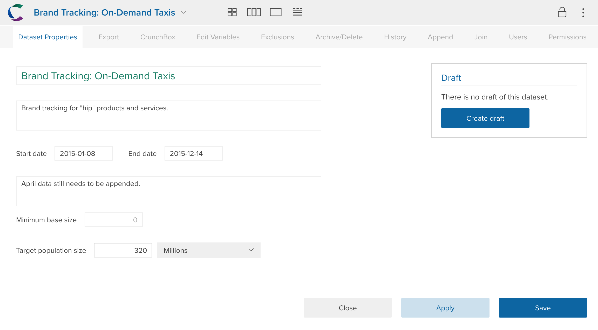

Open dataset properties by clicking on the dataset name in the upper left. Dataset properties can be edited by the active editor (see [Datasets with Multiple Editors](crunch_multiple-editors.html)).

###General Properties

The primary dataset properties page allows you to edit the following:

**Name** – Click the dataset name to edit it.

**Description** - Click the dataset description to edit it.

**Start Date/End Date** - When was the data collected? These properties are included to allow start and end dates (distinct, obviously, from dataset creation or modification times) to be included as dataset attributes.

**Notes** - If you have more detailed notes about the dataset beyond its description, you can include them here.

###Other Dataset Properties

The tabs at the top of dataset properties allow you to perform other dataset wide actions:

[Export](crunch_exporting-data.html) – Export the dataset or a subset of it to a CSV or SPSS file.

[Organize](crunch_organizing-variables.html) – Create a folder structure and order for variables. Dataset editors only.

[Exclusions](crunch_creating-exclusions.html) – Specify a set of rows that will be excluded from the dataset for all users (e.g. incomplete responses). Dataset editors only.

[Archive/Delete](crunch_archiving-deleting-datasets.html) – Archive or permanetly delete this dataset. Dataset editors only.

[History](crunch_dataset-history.html) – Create save points on the dataset or restore the dataset to an existing save point. Dataset editors only.

[Append](crunch_appending-data.html) – Append new rows onto a dataset. Dataset editors only.

[Share](crunch_sharing-properties.html) – See who has access to the dataset, change permissions, and add and remove users. Dataset editors only.