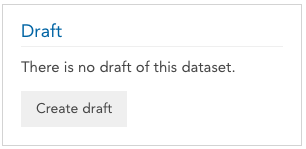
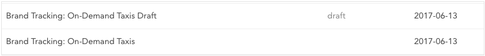
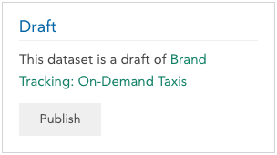

Creating a draft of a dataset allows you to make significant changes to a dataset already shared with your clients, and then publish all changes to them at once, with minimal interruption to their workflow.

### Creating a Draft

To create a draft of a dataset, click the dataset name and select **Properties** from the dropdown. If you are a dataset editor, you will see the **Create Draft** button on the right side of the page.

Click **Create Draft** to create and open a draft of the current dataset. Now you can append new rows of data, reorganize variables, create new variables, and edit dataset and variable metadata in the draft, without affecting the current published version of the dataset. The draft dataset is automatically made available to other users who have edit permissions on the current dataset, so multiple editors can make changes collaboratively or allow other stakeholders to review and sign off on changes. Other editors will see the draft marked with the draft label.

We recommend not editing the original dataset while the draft exists (and anyone who attempts to do so will see a warning). If you are not happy with the changes you've made in a draft you can [delete it](crunch_archiving-deleting-datasets.html) and create a new one.

### Publishing

Once you are satisfied with the draft, your changes can be published by returning to dataset properties in the draft and clicking **Publish**. The original dataset will be updated with the changes from the draft and the draft will be deleted.

