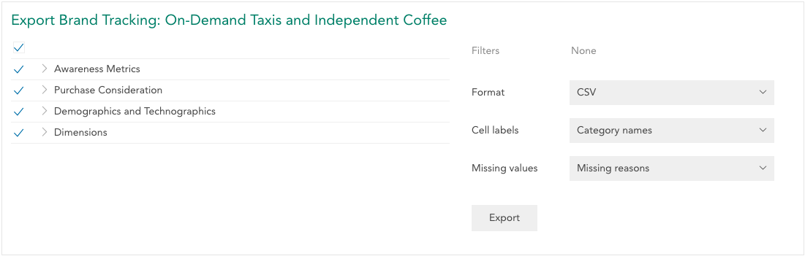

Export data by opening [Dataset Properties](crunch_dataset-properties.html) and then clicking **Export**.

Select a format (SPSS or CSV) from the **Format** selector and click the **Export** button. The button will read **Exporting...** while the export is prepared.

Once the export is complete, the **Export** button will be replaced by **Download** and **Cancel**.

Click **Download** to download the resulting file using your browser. Click **Cancel** to cancel the export.