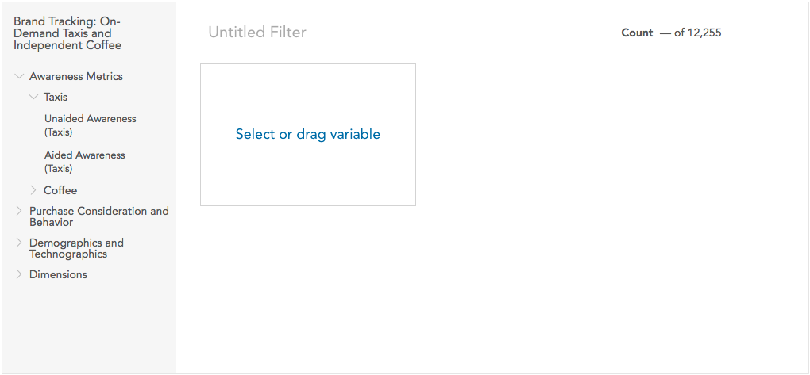
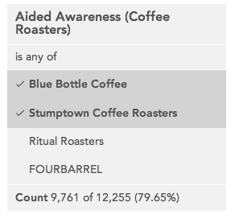
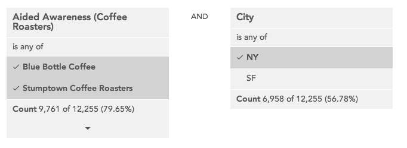

### Filters

Filters are used to show a subset of the data that matches a specified set of values for specified variables. The **Filters** area near the top of the page shows what filters are currently applied. 

### Adding a quick filter

<a class="video" onclick="window.open('https://www.youtube.com/embed/i93Ujcq8HYc?rel=0&amp;controls=0&amp;autoplay=1', '_blank', 'location=yes,height=650,width=1120,scrollbars=no,status=yes');">See video</a>

The fastest way to filter data is to add a **quick filter**. A quick filter filters the data by a single value of a single variable. Quick filters are not saved for later use nor can editors make them available to other users. To create a quick filter, drag a variable from the sidebar or search panel onto the **Filter by** dropzone.

Once the filter is dropped, a dropdown will open showing the categories in that variable. Select one of the categories to close the dropdown and create a filter.

The new filter will be named **Variable Name: Category Name**.

If you click a quick filter, the dropdown will reopen and you can select a different category (allowing you, for example, to quickly look at the data filtered by several categories of the same variable).

### Selecting an existing filter

<a class="video" onclick="window.open('https://www.youtube.com/embed/-WHfiIMiwUk?rel=0&amp;controls=0&amp;autoplay=1', '_blank', 'location=yes,height=650,width=1120,scrollbars=no,status=yes');">See video</a>

More complex filters can be built using the filter builder. These filters will appear in the dropdown that is displayed when you click **Filters**.

A • next to a filter indicates that it was created by a dataset editor and made available to all dataset users.

If you click one of these built filters in the filter bar, you can swap the filter in place of another one. To add a second built filter, click the + that appears when hovering near an existing filter.

### Removing a filter

To remove a filter, hover over it in the filter bar and click the 'x' that appears in the corner.

### Building a Filter

<a class="video" onclick="window.open('https://www.youtube.com/embed/_X3ZruMhD84?rel=0&amp;controls=0&amp;autoplay=1', '_blank', 'location=yes,height=650,width=1120,scrollbars=no,status=yes');">See video</a>

Select **New filter…** from the drop-down menu to open the filter builder. 

A filter can contain one or more conditions. To add a condition choose a variable in the sidebar and click it or drag it to the target to see the categories for that variable.

Click the categories in the variable to toggle them off and on for the filter you are building. The filtered count for the condition is displayed at the bottom of the condition.

You can select or deselect all categories at once using the checkbox in the header.

By default, all selected categories will be filtered, but you can use the dropdown at the top to filter on categories not selected (e.g. "Not California"). If a condition is created from a multiple response variable, this dropdown also allows you to filter based on either *all* of the categories being selected or *any* of the categories being selected.

When you add multiple conditions you can choose whether all conditions have to be true (AND) or whether any condition has to be true (OR).

To delete a condition from a filter, click the X that appears in the upper right corner when you hover.

Once a filter has one or more conditions and a name it can be saved.

After saving a filter it will be automatically applied.

Only you can see filters you have created on your account unless you are a dataset editor.

### Editing or deleting a filter

You can only edit or delete filters you have created unless you are a dataset editor.

To edit a filter you can either:

  * Click edit next to a filter name in the drop down list or

  * Select “Edit filter…” after clicking an already selected filter in the filter bar.

This opens the filter builder with the selected filter. When editing a filter click Delete in the lower right to delete it.

You can view, but not edit, filters that are available to all users on the dataset.