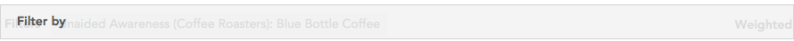
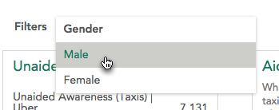
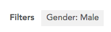
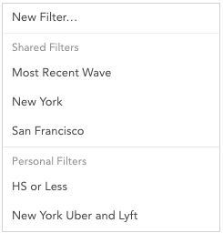

### Filters

Filters are used to show a subset of the data that matches a specified set of values for specified variables. The **Filters** area near the top of the page shows what filters are currently applied.

### Creating a filter

<a class="video" onclick="window.open('https://www.youtube.com/embed/iKicbL0NpGg?rel=0&amp;controls=0&amp;autoplay=1', '_blank', 'location=yes,height=650,width=1120,scrollbars=no,status=yes');">See video</a>

The fastest way to make a filter to drag a variable from the sidebar and drop it on the **Filter by** dropzone.

Once the variable is dropped, a dropdown will open, allowing you to choose the category of the variable to filter by.

The new filter will be named **Variable Name: Category Name**.

If you click a filter created in this manner, the dropdown will reopen and you can select a different category (allowing you, for example, to quickly look at the data filtered by several categories of the same variable).

### Selecting an existing filter

<a class="video" onclick="window.open('https://www.youtube.com/embed/dJeEyXvu228?rel=0&amp;controls=0&amp;autoplay=1', '_blank', 'location=yes,height=650,width=1120,scrollbars=no,status=yes');">See video</a>

When you click the filter bar, you may see one or more filters available that were created and saved by the dataset editors.

**Shared Filters** can only be created by editors and are available to all users on a dataset. **Personal Filters** are filters you created and are only available to you.

Click a saved filter to replace the current filter with the selected one. You can add a second or third saved filter by clicking the + that appears when hovering near the filter bar.

### Removing a filter

To remove a filter, hover over it in the filter bar and click the 'x' that appears in the corner.

### Saving an Existing Combination of Filters

Once you have created multiple filters you may find it useful to save that combination of filters into a single filter. To do this, select **Save Applied Filters...** from the filter dropdown. This will open the filter builder with the currently selected filters combined into one. See [Building Filters](crunch_building-filters.html) for more information on the filter builder.
