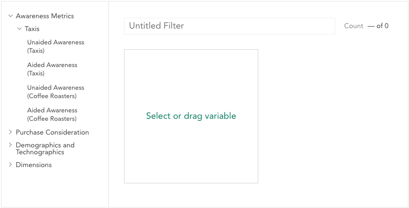

### Filters

Filters are used to show a subset of the data that matches a specified set of values for specified variables. The **Filters** area near the top of the page shows what filters are currently applied.

### Creating a filter

<a class="video" onclick="window.open('https://www.youtube.com/embed/iKicbL0NpGg?rel=0&amp;controls=0&amp;autoplay=1', '_blank', 'location=yes,height=650,width=1120,scrollbars=no,status=yes');">See video</a>

The fastest way to make a filter to drag a variable from the sidebar and drop it on the **Filter by** dropzone.

Once the variable is dropped, a dropdown will open, allowing you to choose the category of the variable to filter by.

The new filter will be named **Variable Name: Category Name**.

If you click a filter created in this manner, the dropdown will reopen and you can select a different category (allowing you, for example, to quickly look at the data filtered by several categories of the same variable).

### Selecting an existing filter

<a class="video" onclick="window.open('https://www.youtube.com/embed/dJeEyXvu228?rel=0&amp;controls=0&amp;autoplay=1', '_blank', 'location=yes,height=650,width=1120,scrollbars=no,status=yes');">See video</a>

When you click the filter bar, you may see one or more filters available that were created and saved by the dataset editors.

A • next to a filter indicates that it was created by a dataset editor and made available to all dataset users.

If you click one of these saved filters, you can swap the filter for another one. You can add a second or third saved filter by clicking the + that appears when hovering near the filter bar. 

### Removing a filter

To remove a filter, hover over it in the filter bar and click the 'x' that appears in the corner.

### Building a Filter

<a class="video" onclick="window.open('https://www.youtube.com/embed/2dJ1eQB-ugk?rel=0&amp;controls=0&amp;autoplay=1', '_blank', 'location=yes,height=650,width=1120,scrollbars=no,status=yes');">See video</a>

Use the filter builder if:

* You want to create a more complex filter that includes multiple categories or multiple variables.

* You want to save the filter to use later.

* You are a dataset editor and you want to create a filter that anyone who has access to the dataset can use.

To open the filter builder, select **New filter…** from the drop-down menu. 

A filter can contain one or more conditions. To add a condition choose a variable in the sidebar and click it or drag it to the target to see the categories for that variable.

Click the categories in the variable to toggle them off and on for the filter you are building. The filtered count for the condition is displayed at the bottom of the condition.

You can select or deselect all categories at once using the checkbox in the header.

By default, all selected categories will be filtered, but you can use the dropdown at the top to filter on categories not selected (e.g. "Not California"). If a condition is created from a multiple response variable, this dropdown also allows you to filter based on either *all* of the categories being selected or *any* of the categories being selected.

When you add multiple conditions you can choose whether all conditions have to be true (AND) or whether any condition has to be true (OR).

To delete a condition from a filter, click the X that appears in the upper right corner when you hover.

Once a filter has one or more conditions and a name it can be saved.

If you are a dataset editor, you will see a public/private toggle in the upper right. Private filters can only be seen and used by you; public filters are avilable to all users on the dataset. If you are not an editor, you can only make filters for your own use.

After saving a filter it will be automatically applied.

### Editing or deleting a filter

You can only edit or delete filters you have created unless you are a dataset editor.

To edit a filter you can either:

  * Click edit next to a filter name in the drop down list or

  * Select “Edit filter…” after clicking an already selected filter in the filter bar.

This opens the filter builder with the selected filter. When editing a filter click Delete in the lower right to delete it.

You can view, but not edit, filters that are available to all users on the dataset.