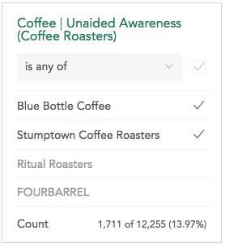

### Selecting a Filter

The **Filters** area at the top of the workspace shows whether and how the
data is filtered. A filter subsets the data to show only the rows with that
characteristic. When no filters are applied, None appears next to **Filters**.
To filter the data, click None to show a list of available filters.

Filters with a dot next to them are owned by the dataset owner. If you create
filters they will not have a dot.

Click the current filter to change it or, to add a second filter, click the +
that appears when hovering near an existing filter.

### Creating a Filter

Select New filter… from the drop-down menu to create a new filter. This opens
the filter builder.

A filter consists of one or more conditions. To add a condition choose a
variable in the sidebar and click it or drag it to the target to see the
categories for that variable.

Click the categories in the variable to toggle them off and on for the filter
you are creating. The filtered count for the condition is displayed at the
bottom of the condition. .

When you add multiple conditions you can choose whether all conditions have to
be true (AND) or whether any condition has to be true (OR).

Click the arrow that appears in the upper right of a condition when you hover
over it to delete a condition from the filter.

Once a filter has one or more conditions and a name it can be saved.

After saving a filter it will be automatically selected.

Only you can see filters you have created on your account.

### Editing and Deleting Filters

To edit a filter you can either:

  * Click edit next to a filter name in the drop down list or

  * Select Edit filter… after clicking an already selected filter in the filter bar.

This opens the filter builder interface that was used to create the filter.
When editing a filter click Delete in the lower right to delete it.

Filters that were created by the dataset owner can be viewed, but not edited.

