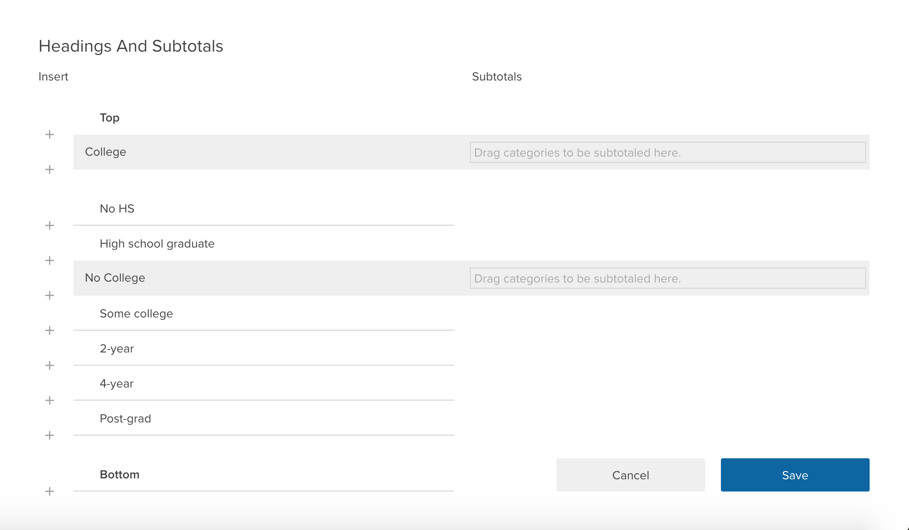
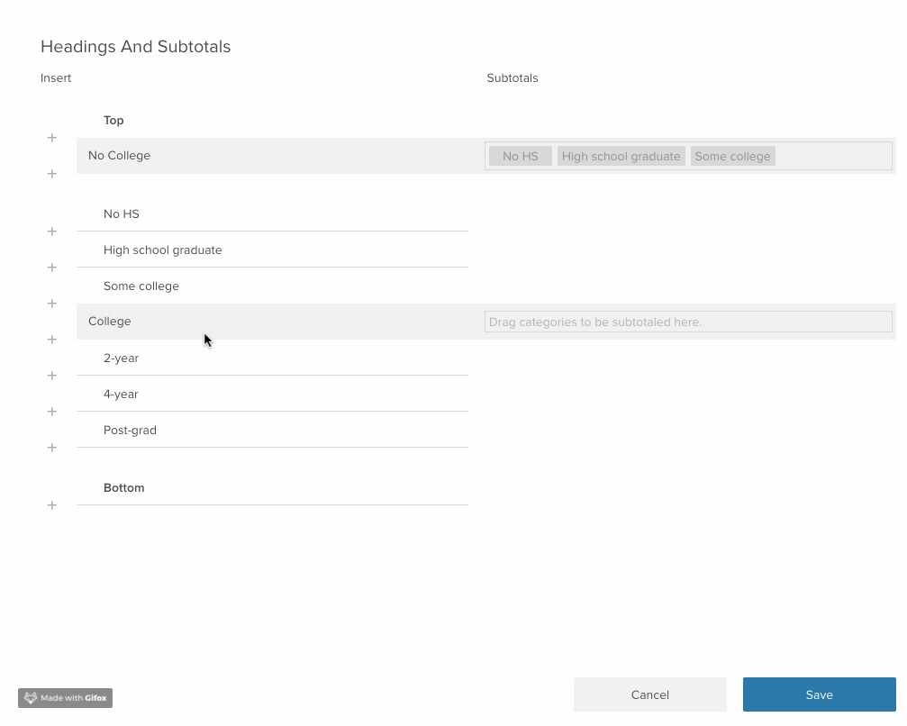

A common task in the market research world is to collapse two or more categories together to see how the collapsed categories compare to one another. For example, if you asked people to rate their preference on a scale of 1 to 10, you might want to see how the people who provide a rating between 1 and 5 compare to those who rated it between 6 and 10. This goes by a number of names, including “_Top Box_” or “_Nets_”, depending on the use case. In Crunch, we call this family of features _Subtotals_. 

Subtotals can be applied to any Categorical variable by opening the variable `Properties` menu and selecting `Headings and Subtotals`. This brings up a list of the variable categories which allows you to insert headings or subtotals in the appropriate location. 

To create either headings or subtotals, first click the plus sign where you want the heading to appear in the list of categorical variables. 

If you stop here you will have created a _Heading_ which is just a label that helps organize the categories in a categorical variable. If you want to turn these headings into subtotals, drag the variable whose values you want to subtotal into the heading. 

When you go back to the variable card you will not see the subtotals next to the existing categories. 

Whenever you include this variable in an analysis or multitable, the subtotals will be cross-tabulated just like any other category. For example here we are taking a look at our subtotaled categories by gender.  

