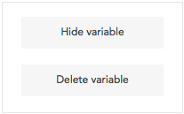
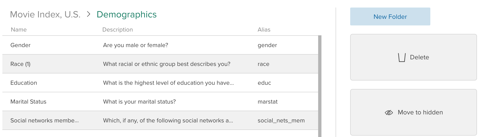

Dataset editors can hide or delete variables. Hiding a variable keeps it in the dataset, allowing weights, filters, analyses, and variables derived from that variable to remain unaffected. Deleting a variable permanently removes it from the dataset – this may affect items derived from that variable and should be done with caution. 

Viewers can only delete variables they derived (see [Deriving Variables](crunch_creating-variables.html)).

Crunch provides a few ways to hide or delete variables:

* Open [Variable Properties](crunch_variable-properties.html) and use the **Hide variable** or **Delete variable** buttons.

* In the [Variable Organizer](crunch_organizing-variables.html), select one or more variables and click **Hide** or **Delete**.

