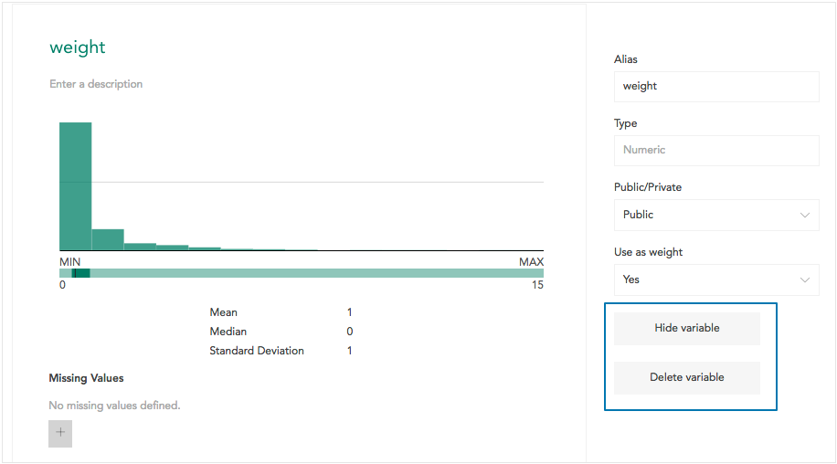

Dataset editors can hide or delete variables in a dataset. Deleting a variable permanently removes it from the dataset – this may affect items derived from that variable and should be done with caution.

Hiding a variable keeps it in the dataset and **editors** can access the folder of hidden variables. Viewers of a dataset cannot see the values or many details about hidden variables. Editors might choose to hide variables they use for exclusion filters or in constructing a weight model. Variables used in shared filters, decks, or multitables should not be hidden from viewers.

Viewers can only delete variables they derived (see [Deriving Variables](crunch_creating-variables.html)).

Crunch provides a few ways to hide or delete variables:

* Open [Variable Properties](crunch_variable-properties.html) and use the **Hide variable** or **Delete variable** buttons.

* In the [Variable Organizer](crunch_organizing-variables.html), select one or more variables and click **Hide** or **Delete**.

