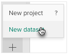

To import data directly from Survey Monkey to Crunch, follow these steps:

## 1. Click the + in the lower left hand corner and select New Dataset.

## 2. Connect to Survey Monkey

Click the **Connect** button under the Survey Monkey logo.

This will redirect you to Survey Monkey, where you can authorize the connection to Crunch. After connecting you will be redirected back to the Crunch application, where you'll need to need to click the **+** and select **New Dataset** again, as per step 1. The **Connect** button will be replaced with your Survey Monkey user name and a **Select Survey** button.

## 3. Select the Survey to import

Click **Select Survey**. A list of available Survey Monkey surveys opens.

Select a survey and click **Import** to import it from Survey Monkey. After the import completes you will be redirected to the imported dataset.
