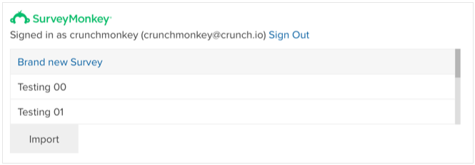

Crunch provides an easy to use importer to import data from Survey Monkey and
to analyze the survey data.

## Connect to Survey monkey

On the import dataset form you will find a button underneath the Survey Monkey
logo that will allow you to connect with your Survey Monkey account.

After you click this button, you will be redirected to Survey Monkey, where
you will have to login and accept the connection to Crunch, after accepting you
will be redirected back to the Crunch application. You'll need to click through
to the "Create Dataset" form again.

## Select the Survey

On the form it will now show you what user account is connected to Crunch, and
a button that will fetch a list of surveys from Survey Monkey.

Click the button. After a couple of seconds your available surveys will be
listed.

After selecting your survey press the "Import" button to start the import of
the survey from Survey Monkey.

During the import a progress bar will display the current progress of importing
the data, after the import you will be redirected to the newly imported
dataset.

