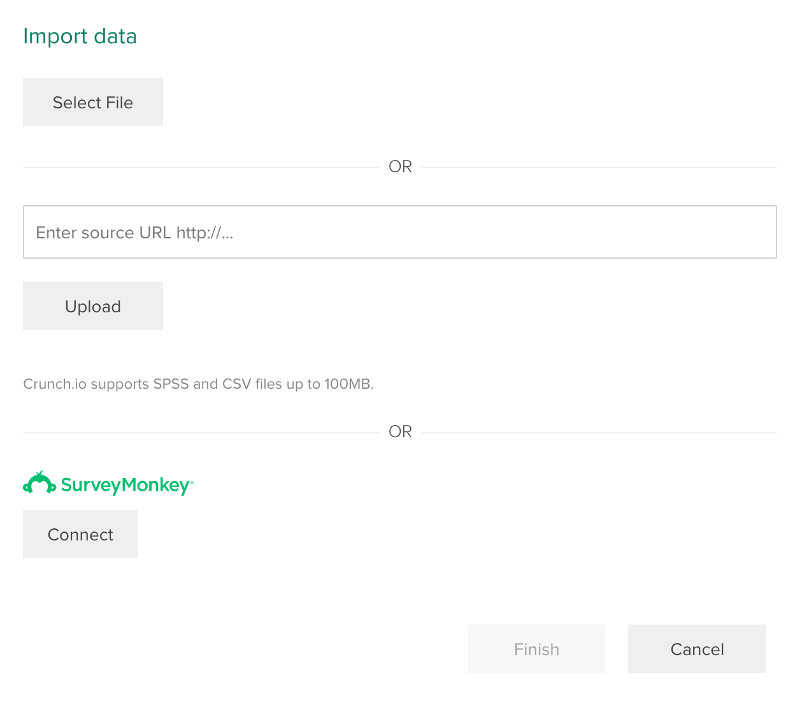

Crunch provides a nice clean user interface, however if you have no datasets it
has a lot of big open white space.

## Creating a new dataset

In the bottom left corner of the Crunch application you will find a + button

When clicked it will allow you to create a new project, or create a new
dataset, click the create new dataset button.

A new dialog will open with a variety of options

Select the appropriate options and click the Finish button to complete the
creation of the dataset.

