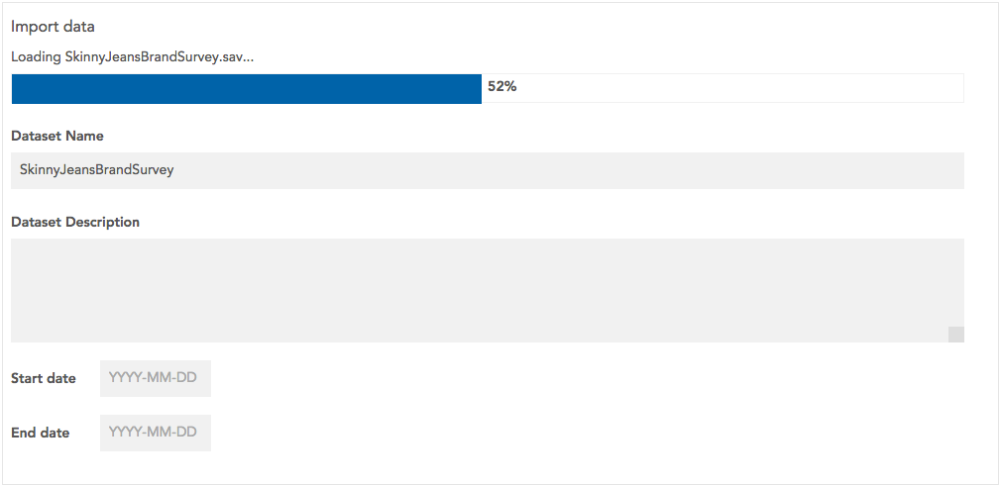

SPSS and CSV files can be imported into Crunch.

CSV and SPSS files may also be contained in Zip files. If a Zip file is provided,
it must contain exactly one SPSS or CSV file.

To import data:

* Go to the datasets list. This is where you will land after signing in. You can return to the datasets list at any time by clicking the Crunch logo or by closing the currently open dataset by clicking the dataset name and selecting **Close**.

* Click the + at the bottom of the sidebar and select **New Dataset**. 

* Select either **Comma-seperated values** or **IBM SPSS**.

* You can select a file on your local computer, or enter the URL of a file that is hosted somewhere else:
    * To select a local file, click **Select File** and use your computer’s file selector to choose a file.
    * To import a file from a URL, enter the URL under **Enter Source URL** and click **Upload**.
* While the dataset uploads, you can enter a name, description, and start and end dates – a default name will be provided based on the file name.

If your input data file is over 100 megabytes, you should use a file-hosting service and
import using hosted URL.

Once the dataset has finished importing, click **Finish**. The newly imported dataset will open.
