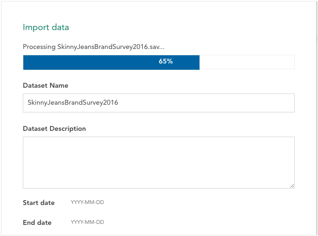

SPSS and CSV files can be imported to Crunch using the web application. To import data:

<ol>
<li>Go to the datasets list. This is where you will land after signing in. You can return to the datasets list at any time by clicking DATASETS at the top of the page.   </li>
<li>Click <strong>Import Data</strong> to open the importing interface. 

</li>
<li>Select a file on your local computer, or enter the URL of a file that is hosted somewhere else:</li>
<ul>
<li>To select a local file, click <strong>Select</strong> and use your computer’s file selector to choose a file.</li>
<li>To import a file from a URL, enter the URL under <strong>Enter Source URL</strong> and click <strong>Upload</strong>.</li>
</ul>
<li>As the file uploads, you can choose a name for it - a default name will be provided based on the file name.</li>
</ol>

Once the dataset has finished importing, click <strong>Finish</strong>. The newly imported dataset will open.

