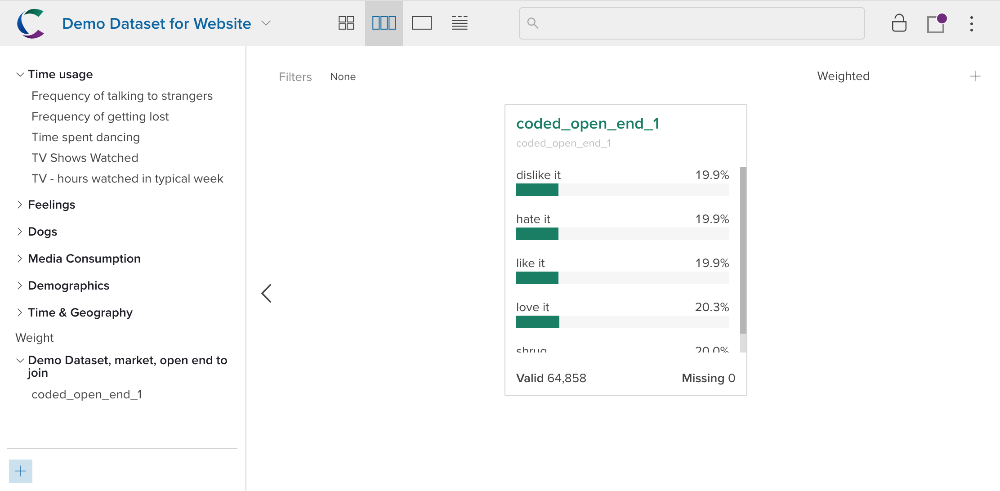

You can extend a dataset by adding variables from another dataset that match the current one on some **key** variable (typically called a ‘left join’).

To append data, click the dataset name in the upper-left and then select the **Join** tab. Navigate through the project and dataset list to find the dataset you want to join.

Select a dataset and click **Next** and then choose the name of the matching key in each dataset. Joining may take some time depending on the size of your datasets. Once you are finished, you will either see a success message or you will be informed that the join failed. Check that the keys are the same type and actually identify rows that should match, and ensure that the new data you’re joining does not contain any aliases already present in the dataset. The joined data will appear in a new folder in the list of variables.

