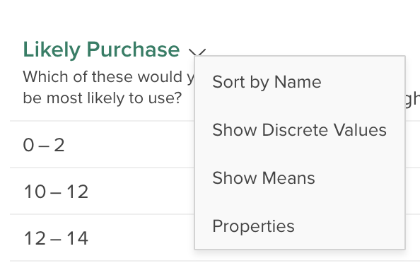

Multitables allow you to create analyses using multiple column variables. Sometimes called 'banners' or 'crossbreaks', they let you quickly see multiple breakdowns of a variable of interest. To use multitables, start by selecting multitable view from the view toggle at the top of the application:

### Using Existing Multitable Definitions

When multitable view is opened, the most recently created multitable definition that is available to you will be applied, with the first variable in the dataset being used as the rows.

To change the multitable definition, click the name in the upper left and select the definition you want to use from the dropdown menu.

### Showing means in a multitable

If you are using a numeric variable or a categorical variable that has numeric values (see [Variable Properties](crunch_variable-properties.html)), you can right click the row variable and select **Show Means** to show a single row containing the mean of the row variable in each column. Right click again and select **Show Ranges** (numeric) or **Show Categories** (categorical) to toggle back to the original view.

### Exporting a Multitable to Excel

You can export the currently displayed multitable to Excel by clicking **Export** in the upper-right corner in multitable view, and then choosing **Export this table**. See [Exporting Tab Books](crunch_tabbooks.html) for more information about exporting an entire tab book using the currently selected multitable header.

### Creating and Editing Multitable Definitions

You can create one or more multitable definitions (collections of column variables) in a dataset. If you are a dataset editor, you can make these definitions available to all users on a dataset.

When multitable view is opened, if there are no multitable definitions available to you, the builder will open immediately. Otherwise, you can open the builder by clicking the multitable name in the upper-left corner and selecting **New multitable...**. You can also view or edit an existing multitable by hovering over it in the dropdown list and clicking **view** or **edit**. Which option is available depends on whether you have permission to edit that multitable - multitables that you do not have permission to edit will have a dot next to them, just like filters.

You can add variables to the multitable definition by clicking them or dragging them from the sidebar. You can remove a variable that you've added by hovering over it and clicking the **x** that appears next to the name.

#### Hiding Columns

You may wish to hide some columns of a multitable (for example 'decline to state' or 'not asked'). You can hide a multitable column by clicking on the column title – it will turn gray. Click the column title again to unhide it. When the multitable definition is used, this column will not be displayed. At this time, when exporting to a tab book (see above), all columns will be exported, whether hidden or not – we will be improving this in a future release.

#### Sharing Multitable Definitions

If you are a dataset editor, you will see a **Personal/Shared** toggle in the upper-right corner.

Set it to **Shared** to allow all users on the dataset to see and use this set of variables as column headers. Set to **Personal** to only make it available to yourself.

#### Deleting a Multitable Definition

To delete a multitable definition, edit it, click **Delete** in the lower-right corner, and confirm that you'd like to delete it.
