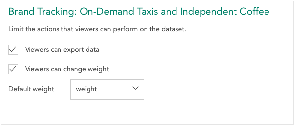

The Permissions tab allows an editor to determine what actions a viewer can perform on the dataset and set a default weight.

You can set the following options:

**Viewers can export data** – If set, viewers will see the [Export](crunch_exporting-data.html) tab, allowing them to export the dataset to CSV or SPSS.

**Viewers can chang weight** – If set, viewers will be able to use the weight dropdown to [Change the Weight](crunch_weighting.html). Otherwise, viewers will just see an indication of whether the data is weighted or unweighted.

**Default Weight** – Use the dropdown to pick from existing weights. This is the weight that will be set when this dataset is first opened by a user (e.g. after it is shared or added to a project).
