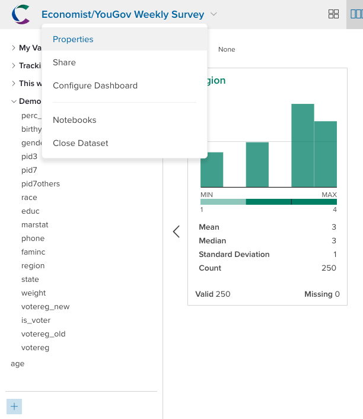
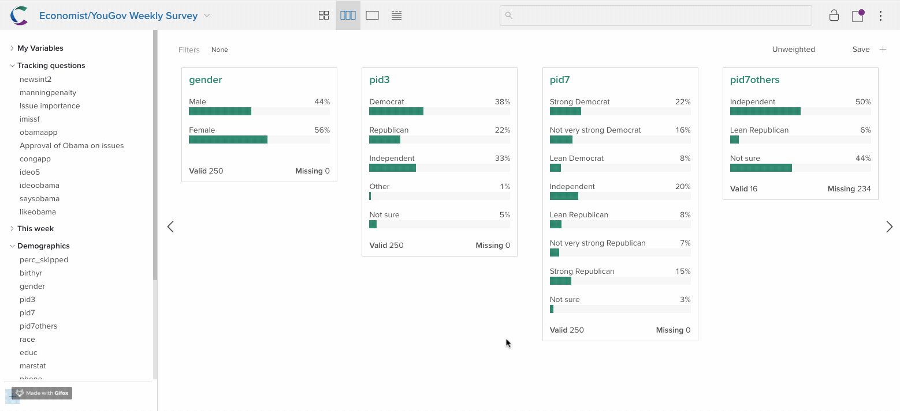

Market researchers are often interested in population estimates. If a survey shows that 10% of respondents fall into a particular category they might be interested in how many people that proportion represents. One simple way to do this is to just multiply the percentage of people who fell into the category by a target population number. Crunch lets you set the target population for a dataset, and see variable summaries and calculations in terms of that population. 

To set the target population, go to the dataset properties menu:

You can enter a Target population size and a order of magnitude for the population. For example to create a target population of 9 million, enter `9` in the target population, and select `Millions` from the drop-down. Make sure to save the changes you made to the dataset properties. 

Once you've set a target population, you will see a new option to display the dataset by `POP`. When you select that option all cards, analyses, and multitables will show the population estimate rather than the raw survey numbers or percentages. 

