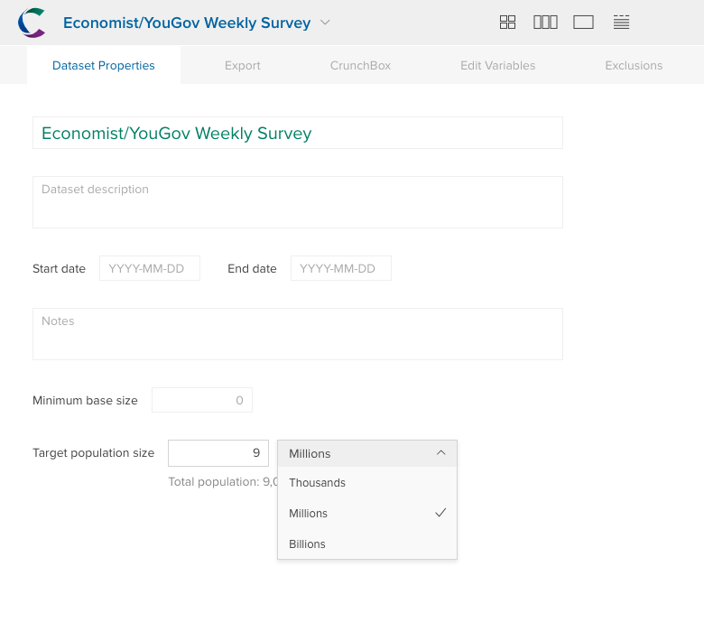

Market researchers are often interested in population estimates. If a survey shows that %10 of respondents are teenagers they might be interested in how many people in the general population are teenagers. Crunch lets you set the target population for a dataset, and see variable summaries and calculations in terms of that population. 

To set the target population, go to the dataset properties menu:

You can enter a Target population size and a order of magnitude for the population size. To create a target population of 9 million, enter `9` in the target population, and select `Millions` from the drop-down. Make sure to save the changes you made to the dataset properties. 

If your dataset has a target population, you will see a new option to display the dataset by `POP`. When you select that option all cards, analyses, and multitables will show the population estimate rather than the raw survey numbers or percentages. 

