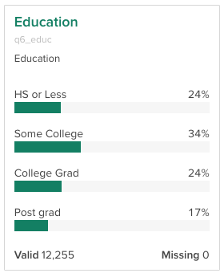
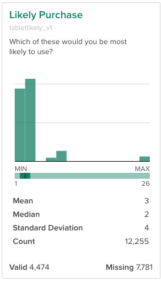
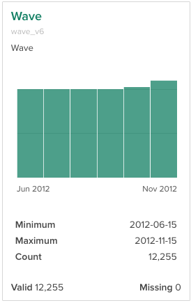
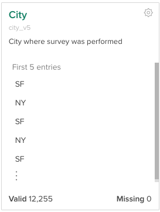
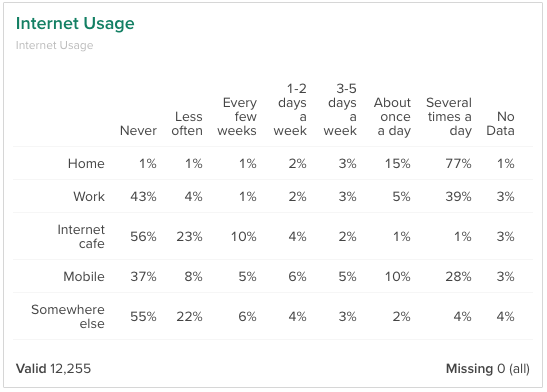
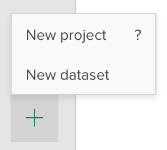

## Quick-Start Guide

### Step 1: Import a dataset to Crunch
To import a dataset, sign in to Crunch and then click the + button in the lower-left corner and select **New Dataset** (not **New Project**). You can upload SPSS and CSV files to Crunch by uploading them from your computer or by pointing the app to a URL where the file is hosted. Data can also be imported from R [using the Crunch R package](http://crunch.io/r/crunch/articles/datasets.html).

We recommend you upload your data directly from your survey system into Crunch *first*, and then after it is uploaded, begin to edit the dataset in Crunch. There is no technological barrier to doing it the reverse, where you take the data from the survey system, process it locally, and then upload into Crunch, but that work flow invites version control problems ("data_v7_final_FINAL").

### Step 2: Clean the data
Once your data is imported to Crunch, we recommend taking the following steps to make it look more polished and more efficient to navigate. 
* [Give the dataset a friendly name](http://support.crunch.io/crunch/crunch_dataset-properties.html)
* [Hide some variables from view (e.g. “home_address” or other personally identifying information)](http://support.crunch.io/crunch/crunch_organizing-variables.html#hiding-unhiding-and-deleting-variables)
* [Organize variables into folders](http://support.crunch.io/crunch/crunch_organizing-variables.html)
* [Give variables friendly names](http://support.crunch.io/crunch/crunch_organizing-variables.html#editing-variable-and-folder-names-descriptions-and-aliases)
* [Exclude “bad” cases (e.g. age > 125 years old)](http://support.crunch.io/crunch/crunch_creating-exclusions-dsprops.html)
* Bind together columns of "hierarchical" questions (aka ["multiple response"](http://support.crunch.io/crunch/crunch_creating-a-multiple-response-variable.html) or ["array"](http://support.crunch.io/crunch/crunch_creating-an-array-variable.html) )
* [Weight the data](http://support.crunch.io/crunch/crunch_weighting.html)
* [Create Filters](http://support.crunch.io/crunch/crunch_building-filters.html)
* [Create Multitables (aka “banners”, “crossbreaks”, or “tabs”)](http://support.crunch.io/crunch/crunch_multitables.html)
* [Build a dashboard showing key tables and graphs](http://support.crunch.io/crunch/crunch_dashboards.html)
* [Build a Crunchbox to report on and analyze just select variables](http://support.crunch.io/crunch/crunch_crunchbox.html)
* [Share the dataset with others](http://support.crunch.io/crunch/crunch_sharing-a-dataset.html)

## In-Depth Guide
Crunch is designed to help you prepare and share data with your clients using an intuitive, web-based client.  The app was built with survey data in mind, and is optimized for working with very wide datasets which may have thousands of variables. Crunch also gives analysts the ability to weight datasets, efficiently store and analyze multiple-response variables, and share a single dataset with distinct clients.

This guide will explain how you can import data from a file and deliver a polished dataset to your clients that includes:

* A dashboard showing key tables and graphs.
* Friendly names and labels for the variables and responses in the data
* A logical, multi-level order for the variables in your dataset.
* Weighting that you can create from an existing set of weight coefficients or generated by inputting weight targets yourself.
* Pre-built filters that guide clients to the most relevant data
* Pre-built multitables (also known as banners or crossbreaks) that you or your clients can use to rapidly export customized tab books.

It will also explain how you can share the prepared data with clients, where they can use the Crunch platform to further explore the data.

### Crunch Datasets and Variables
Crunch is a platform that allows you to efficiently store, search, and manage your survey data. Data is stored in Crunch **Datasets**. A dataset is a tabular data structure in which each survey question is stored in a **Variable**, and each response is stored as a row. Each variable has a type, which allows the data to be appropriately processed and analyzed in Crunch:

**Categorical** – Categorical variables are typically used for questions with a discrete set of possible answers. They are summarized with counts of the number of responses in each category.  

**Numeric** – Numeric variables are for storing numbers. Their summary shows a histogram, along with some other statistics about the distribution of the data.

**Date/Time** –  For storing temporal information which can be used to filter by date or create time series graphs.

**Text** - Text variables store free-form text data. They differ from categorical variables in that they do not have set categories but can contain any text. Summary cards show the first few rows of data in the variable.

**Categorical Array** – Array variables are for storing multiple categorical variables with similar categories, as in when you have several survey questions which all ask how strongly someone agrees with a statement. Each row of the array is stored in a "subvariable", which can be accessed and analyzed separately, but for summary purposes, the array is displayed together as a "grid".

**Multiple Response** – Multiple response variables are designed to store answers to the “Select all that apply” questions in which a survey respondent can select one or more answers among a set of categories. Each of the individual responses to the question are stored in a "subvariable", as in categorical array variables. Subvariables are then grouped together and displayed as a single variable that efficiently summarizes the multiple response question.

### Importing a dataset

To add a dataset, click the + button and select **Add Dataset**. You can upload SPSS and CSV files to Crunch either by uploading them from your computer or by pointing the app to a URL where the file is hosted. Data can also be imported from R [using the Crunch R package](http://crunch.io/r/crunch/articles/datasets.html).

We recommend you upload your data directly from your survey system into Crunch *first*, and then after it is uploaded, begin to edit the dataset in Crunch. There is no technological barrier to doing it the reverse, where you take the data from the survey system, process it locally, and then upload into Crunch, but that work flow invites version control problems ("data_v7_final_FINAL").

### Browsing and Analyzing Data

At this time you may wish to explore the dataset you have imported. [Getting Started with Crunch](crunch_getting-started.html) will get you started navigating the Crunch interface, including browsing variable top-lines and creating multivariate analyses with your new dataset. As you explore your new data, you may find things you want to rearrange, modify, or hide before sharing the data with clients. The discussion below will walk you through how to clean and prepare your dataset.

### Preparing the data
These are the steps typically involved in preparing data for clients. Depending on the nature of your data, you may not always need to do all of these steps, but this should provide a checklist of actions to go through to assure your data is ready for presentation.

#### Drop and hide rows and columns
Often when a dataset is imported it will contain rows or columns that you do not wish to share with your clients. To that end you can:

* [Hide rows using an exclusion filter](crunch_creating-exclusions-dsprops.html). You can specify a rule (or series of rules) that will completely hide these rows from all users. For example, if you had a column that indicated that a survey was not completed, you could hide all rows for which that value was true.
* Hide or delete variables (columns). Variables can be hidden from clients or deleted entirely. For example, you may wish to hide personal identification information from data that is shared to clients. A variable can be hidden or deleted via its [Variable Properties](crunch_hide-delete-variables.html). You can also hide or delete variables in batches using the [Variable Organizer](crunch_organizing-variables.html).

#### Edit Variable Names, Descriptions, and Categories
Often when variables are imported their names and descriptions are not formatted for presentation to your clients. You can edit the name, description, and alias of an individual variable by opening its [Variable Properties](crunch_hide-delete-variables.html), or you can quickly edit this metadata on a single page using the [Variable Organizer](crunch_organizing-variables.html).

For categorical, multiple response, or array variables, you can edit the response categories – both the category names as well as their order, in that variable’s properties.

#### Organize Variables into Folders
Crunch lets you present your dataset to the client with an organizational structure that makes sense to them. You can order the variables as they appear in the variable sidebar, including grouping them into expandable folders, using the [Variable Organizer](crunch_organizing-variables.html). As described above, the organizer also allows you to hide or delete variables, and to edit variable metadata.

#### Edit Dataset Metadata
You can edit dataset metadata through the [Dataset Properties](crunch_dataset-properties.html) menu, including the name, description, and survey start and end dates. Access the properties screen by clicking the dataset name and selecting Properties from the menu.

#### Weight the Data
Weighting a dataset allows you to bring the collected responses of a survey in line with the known distribution of a population. For example if you know that half of the population identifies as female, but only 20% of your respondents do so, then you might need to adjust the survey to get a more accurate estimate of the population. This needs to be transparent to other researchers, but can be confusing for end users.

Crunch allows you to create and apply weights to a dataset. Weights can be created either by selecting  a numeric variable in the dataset as the weight (e.g. a scalar variable that was upload with the data), or by specifying the target distribution of one or more categorical variables to create a weight variable which will weight the dataset to that distribution. For more information creating and managing weights in your dataset, see [Weighting](crunch_weighting.html).

#### Create Multiple Response and Array Variables
When data is imported, variables that are meant to be displayed as Multiple Response or Array variables may be displayed as individual Categorical variables. For example, you may want a single variable that indicates whether a user is aware of any of 10 different brands (or to rate them on a 1-to-5 scale), but after importing you have 10 separate variables that each show awareness/rating for one of the brands. Use the [Multiple Response Variable Builder](crunch_creating-a-multiple-response-variable.html) and [Array Variable Builder](crunch_creating-an-array-variable.html) to combine these into the appropriate variable type.

#### Create Shared Variables, Filters, Multitables, and Decks

Crunch allows any user to create the following:

* [Derived Variables](http://support.crunch.io/crunch/crunch_creating-variables.html) – New variables that are based on existing data. These may include variables created by [Combining Categories](crunch_creating-a-combined-variable.html) (e.g. combine “Strongly Approve” and “Somewhat Approve” into “Approve”) as well as [Case-based Categorical Variables](crunch_creating-a-categorical-variable.html) (e.g. define “Soccer Moms” as “25-30 year old women with school-age children” using existing demographic variables).  
* [Filters](crunch_building-filters.html) – Conditions to limit the currently visible data (for example, “18-25 year-old men”).
* [Multitables](crunch_multitables.html) – A set of variables that can be crossed against any variable in the dataset in a single table and used to create and export tab books.
* [Decks](crunch_saving-analyses.html) – Collections of shared analyses that can be loaded and exported.

While clients can create these objects only for their personal use, as the data owner, you can create public versions of any of these for your clients to use. Giving clients a prebuilt set of filters, banners, and important analyses allows them to get what they need from the data faster. Click the links above for more information on how to create these objects and share them with all dataset users.

<!--
### Create a Dashboard
By default, the dataset dashboard will show the dataset summary metadata (name, description, etc).to a view of the dataset properties metadata discussed above. Rather than this summary information, you can build a dashboard that allows you to surface the analyses your clients will find most relevant.

To do this, you can specify any deck in your dataset as the dashboard. To edit your dataset’s dashboard, click the dataset name and select **Configure Dashboard**. See Configuring a Dataset’s Dashboard for more information.
-->

### Sharing the Data
Once the dataset is ready to share to clients, there are a couple of different ways it can be shared:

* [Sharing Directly to a User](crunch_sharing-a-dataset.html) – Click the dataset name and select **Share** to share the dataset directly with users via email address. If any email addresses you enter are not current Crunch users, a basic account (allowing datasets to be viewed, but not edited) will be created for them automatically. A dataset shared in this manner will appear in the user’s Personal Project.
* [Sharing Via a Project](crunch_project-management.html) – A project is a collection of datasets and users who can access all those datasets. Using projects allows you to more rapidly share a dataset with a large, predefined group or users or to give a user access to a group of related datasets all at once.

See the links above for more information on both types of sharing.

### Moving beyond the app

The Crunch web app is designed to make the work done by analysts as intuitive and quick as possible, but for complex custom tasks, we’ve designed Crunch around an accessible [API](http://docs.crunch.io/) and built [R](http://crunch.io/r/crunch/) and [Python](https://github.com/Crunch-io/pycrunch) [clients](https://github.com/Crunch-io/scrunch) for the tool. If you need to perform a complex machine learning task, manipulate your data algorithmically, or send it to a downstream process, you likely need a product which is designed to work with open-source tools. Crunch allows you to access the power and dynamism of open-source tools while while maintaining the user-friendliness of a graphical interface.

Both the API and open-source libraries provide extensive granular control of the Crunch objects. You can create new variables, filter and weight a dataset, and download the data to perform offline analysis or create visualizations. At Crunch, we recognize that many of the most exciting and powerful techniques for analyzing and communicating data are happening within the open-source world, and so we have developed the product to work seamlessly with open source projects rather than trying to duplicate all of their functionality.
