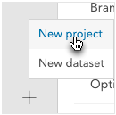
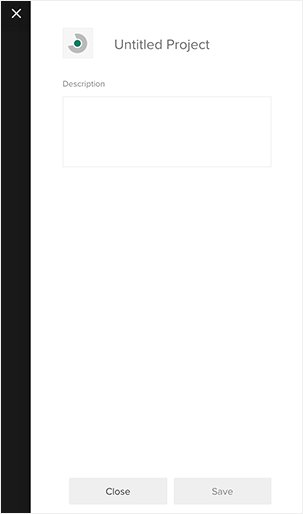
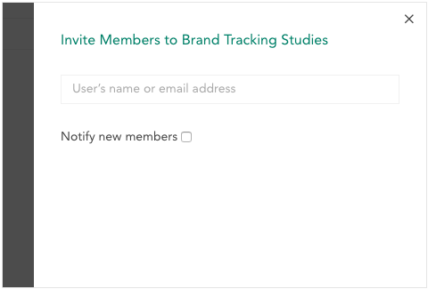
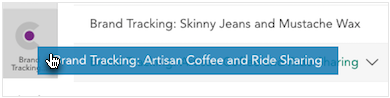
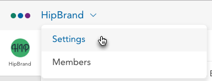
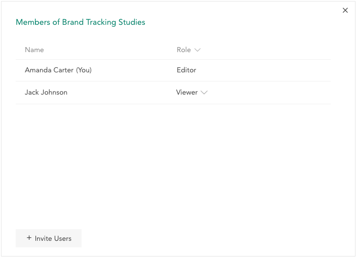

Projects are used to share a dataset or datasets with many other users at once (e.g. clients of a data provider). A project contains one or more users and one or more datasets. All users on a project can access all datasets on that project. This means you can make a dataset available to a group of users, or add a user to a project to give them access to many datasets without sharing each of them individually.

### Creating a Project

To create a project, click the + in the lower left corner and select **New Project** from the menu.

This opens the New Project panel.

Click the project name to change it. Optionally enter a description. You can set a custom icon for the project by clicking the existing and selecting a new one using your file browser. Once you are finished, click **Save** (note that you cannot save until you have specified a name). This opens the **New Members** panel.

Enter the user names or email addresses of the users to add to the project. If you enter any email addresses that are not associated with a Crunch.io user, those users will be invited to Crunch. Set the **Notify new members** option to have an email sent to the users you add.

Once you've added some members and saved (or declined to do so by clicking **Close**), the empty project will open.

### Adding Datasets

You can drag any dataset you own from your Personal Project or from any project you can edit to any project you can edit.

Moving a dataset will remove it from its previous project or your personal project and add it to the new project (a dataset can only belong to a single project). Anyone with edit permission on that project will new be able to edit, move, or delete that project.

### Project Settings

Click the project name and select **Settings** from the dropdown to edit project settings in a panel is identical to the one used to name the project when creating it (see above). Edit the name, description, or icon for the project here.

### Adding and Managing Members

To add and manage members, click the project name and select **Members** from the dropdown. This opens a list of the existing members and their permissions.

Click a user's permission to change it. Users can be either:

**Editor** – Full permission to edit the project and all datasets in the project.

**Viewer** – Permission to view the project and all datasets in the project.

When hovering over a user (other than yourself), an 'x' will appear on the right side of their user listing. Click this to remove them from the project. Any changes you make here will not be applied until you click **Save**.

Click **Invite Users** to open the **New Users** panel, described above.
