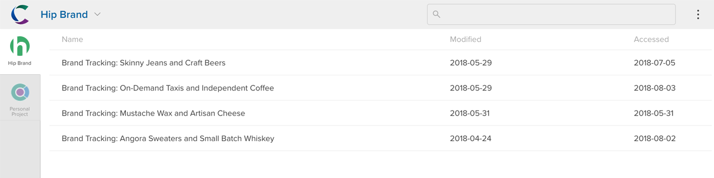

Datasets can be organized into projects by the data owners. A project will have one or more editors who are responsible for its organization and membership.

If you have not been added to any projects, you will not see anything described below (though you may still have access to datasets that have been shared with you). If you belong to one or more projects, you will see the projects sidebar when you open Crunch.io.

All projects you belong to are listed down the left side of the interface. If you are an advanced user with the ability to import and own datasets, your datasets are available under **Personal Projects**.

Click a project to open it. When a project is opened, you can navigate through the project hierarchy using the sidebar. The sidebar shows the folders that make up the project organization. Click a folder name to display its contents on the right side of the interface. The currently displayed folder will be highlighted (e.g. **Android** – the top level folder – in the example above).

If the project contains no folders, the sidebar showing the folder names will be hidden and you will just see a flat list of datasets in the project.

You can sort datasets using the headers at the top and open a dataset by clicking it, just as described in [Opening, Searching, and Organizing Datasets](crunch_selecting-a-dataset.html).