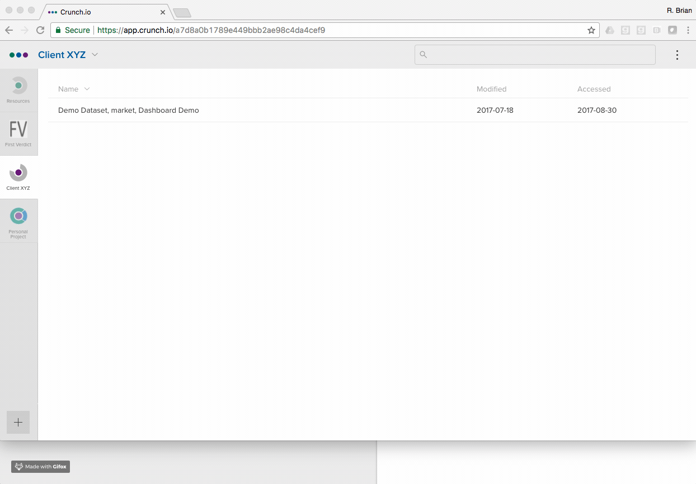

## Importing your data

To add a dataset, log into Crunch, and in the lower left corner of the screen click the `+` button and select “New Dataset” (not “New Project”). You can upload SPSS and CSV files to Crunch either by uploading them from your computer or by pointing the app to a URL where the file is hosted (this will take a few minutes to upload). Data can also be imported from R using the [crunch R package](http://crunch.io/r/crunch/index.html).

## Polishing a dataset that you have imported to Crunch

Once your dataset is imported to Crunch, there are some optional steps you can take to make it look more polished and more efficient to navigate. I suggest you click through these in order.

* [Giving the dataset a friendly name](http://support.crunch.io/crunch/crunch_dataset-properties.html)
* [Hiding variables from view (e.g. “identity”)](http://support.crunch.io/crunch/crunch_organizing-variables.html#h)
* [Organizing variables into folders](http://support.crunch.io/crunch/crunch_organizing-variables.html#editing-variable-and-folder-names-descriptions-and-aliases)
* [Giving friendly names & labels for the variables in the data](http://support.crunch.io/crunch/crunch_organizing-variables.html#editing-variable-and-folder-names-descriptions-and-aliases)
* [Excluding “bad” cases (e.g. age > 125 years old)](http://support.crunch.io/crunch/crunch_creating-exclusions-dsprops.html)
* Binding together columns of “hierarchical” questions (aka “[multiple response](http://support.crunch.io/crunch/crunch_creating-a-multiple-response-variable.html)” or “[array](http://support.crunch.io/crunch/crunch_creating-an-array-variable.html)”)
* [Weights](http://support.crunch.io/crunch/crunch_weighting.html)
* [Filters](http://support.crunch.io/crunch/crunch_building-filters.html)
* [Multitables (aka “banners”, “crossbreaks”, or “tabs”)](http://support.crunch.io/crunch/crunch_multitables.html)
* [Building a dashboard showing key tables and graphs](http://support.crunch.io/crunch/crunch_dashboards.html)
* [Sharing the dataset with others](http://support.crunch.io/crunch/crunch_sharing-a-dataset.html)
