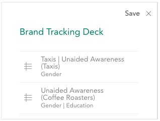
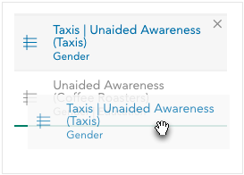
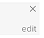
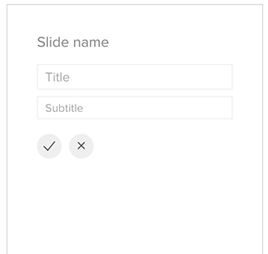
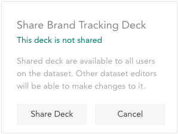
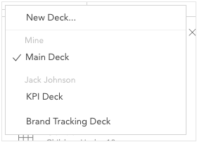

Analyses can be saved to a deck by clicking **Save** in the upper right corner in expanded view.

When you click **Save**, the current deck slides out and the current analysis is saved to it.

The deck can be opened and closed using the + icon to the right of **Save**. When open, the icon becomes an x.

Saved analyses will list the variables used to create the analysis along with an icon that indicates a graph or a table.

The information saved in an analysis includes:

  * The variables used to create the analysis.
  * Any settings in the play controller.
  * Any [filters](crunch_filtering-data.html) that are currently applied.
  * Whether the data is weighted.
  * Any changes to the [variable display](crunch_variable-display-in-expanded-view.html)

Clicking an analysis in the deck will load it into the analysis workspace.

The order of the saved analyses can be changed by dragging them up and down in the list.

Move the mouse over any item and an ✖️ will appear at its upper right; click to remove that analysis.

To edit slide titles move mouse over any item and an **Edit** button will appear at its lower right; click to edit the slide’s title.

Another window will slide and you will be able to edit the slide’s name. You can also add a subtitle. Click **Save**.

### Exporting Analyses

Click the export button at the bottom of the deck to export analyses saved to that deck to Excel.

Each analysis will be put into a separate sheet in the Excel file, and the valid/missing counts, as well as any active filters, will be included alongside the table. Crunch graphs will be exported as tables, but you can use Excel’s tools to define a chart with the numbers in the sheet.

### Using Multiple Decks

Click the deck name to switch between decks or create a new one.

Click **New Deck…** to create a new deck by giving it a unique name.

When you click **Save**, the current analysis will be saved into the currently selected deck, allowing you to save and export multiple sets of analyses.

Click the settings icon in the lower-right corner of the deck to open deck properties, where you can rename delete a deck. Deleting a deck will delete all analyses saved in that deck. Note that you cannot delete your last deck in a dataset.

### Sharing a Deck

If you are a dataset editor, you can share your decks with the other users on the dataset. The other users will be able to load and export analyses, but they will not be able to make changes to your deck. To share a deck, click the share icon at the bottom of the deck:

This opens a panel in which you can share or unshare this deck:

Click **Share Deck** to make this deck available to all users on the dataset. If the deck is already shared, the button will be labeled **Unshare Deck** and will make the deck available only to you.

When the viewer opens their list of decks, they will see decks shared by other users grouped apart from their own collection of decks:

