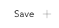

Variable cards can be saved to the deck just like analyses (see [Saving, Exporting, and Sharing Analyses](crunch_saving-analyses.html)).

You can save a variable card in one of two ways:  

* Click the **Save** button in the upper-right corner. This will save the left-most variable card.  

* Hover over a variable card and click the **Save** button that appears below it.  

Once saved, the saved variable card name appears in the deck. Click it to display it (this will open [Card View](crunch_browsing.html) if you are not already in it). Saved variable cards will be exported and shared along with the rest of the deck as described in [Saving, Exporting, and Sharing Analyses](crunch_saving-analyses.html).
