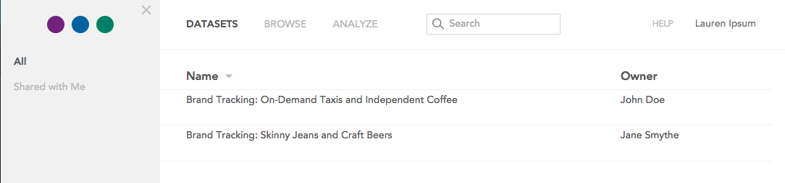
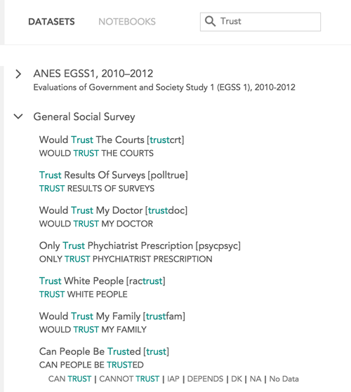
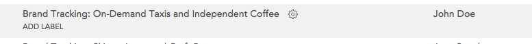
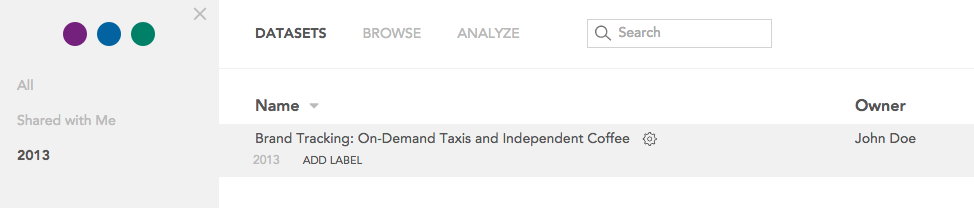

<h3>Opening a dataset</h3>

After signing in to Crunch.io, you will see a list of datasets available to you along with the user who owns that dataset. You can filter the list of datasets using the search at the top of the page.

Click a dataset name to open it.

<h3 dir="ltr" style="line-height: 15.808px;">Organizing datasets</h3>

The search bar doesn’t just index names and owners. It actually knows about all of the metadata inside all of your datasets, so you don’t need to remember whether it was the name of a dataset, content or name of a variable, or even a category name — results show the matched search in context.

<figure><figcaption>Example search results</figcaption></figure>
<h3 dir="ltr">Organizing datasets</h3>

If you have access to a large number of datasets it may be helpful to add labels to them so you can find what you are looking for more quickly. Move your mouse cursor over a dataset to reveal the ADD LABEL button.

Click ADD LABEL to add a label to the dataset. Added labels will appear in the sidebar. You can filter the list of datasets by selecting one of these labels. For example, labeling each dataset with the year it was created allows you to filter the list of datasets by year.

