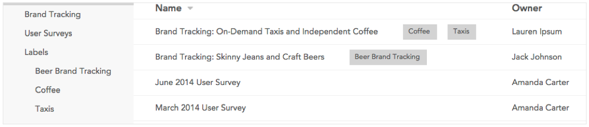

###The dataset list

After signing in to Crunch.io, you will see a list of Datasets to which you have access.

In the left sidebar, click **All** to see all datasets you can access. If you belong to any teams, they will be listed below. Click a team name to see only the datasets available to that team.

The dataset list can be sorted by clicking any column header (e.g. "Name"). Right click a column header to hide and show columns (more options for columns will be available in future releases).

Click a dataset to open it.

### Searching for a dataset

Click the search icon in the upper-right corner to open the search panel. Here you can search for a dataset by name, description, or using the names of any of the variables in the dataset. Click the dataset name to open it. Click a variable name to open the dataset and display that variable card.

### Organizing datasets

If you have access to a large number of datasets you may want to label them. Move
your mouse cursor over a dataset to reveal a dropdown arrow. Click it and select **Add Label**. You'll be able to type a name for the label - it will autocomplete with any existing labels you have created. Once you have created labels, the **Labels** heading will appear in the sidebar, allowing you to filter your dataset list by label. 

